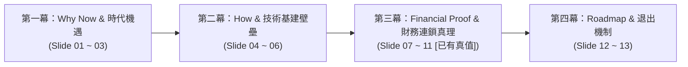

# 📑 Project Indo-Phoenix 商業計劃演示總綱架構與三大 AI 協同提示指引 (PITCH_DECK_BLUEPRINT.md)

> **🎯 本文件之戰略使命 (Mission Statement)**：  
> 本文件為 **Project Indo-Phoenix（印度首座高階航太、國防與車載 FPC 智慧製造樞紐）** 之 WebPPT 頂級商業路演總綱設計藍圖。  
> 專門作為 **人類專案總監與三大頂級大模型（ChatGPT o1/GPT-4o、Claude 3.5 Sonnet、Gemini 1.5 Pro）跨代理人協同之標準提示詞與架構真源（SSOT Blueprint）**。

---

## ⚠️ 給外部協同 AI 代理人 (ChatGPT / Claude / Gemini) 的最高作業守則

> [!IMPORTANT]
> ### 🛡️ 數據防幻覺與單一真值來源 (SSOT Hard-Lock)
> 1. **【5 大財務模型嚴禁重造數據】**：模組 1 至模組 5 的所有財務數據、產能、CapEx、OpEx、BEP 及 IRR **已由線上試算表（Google Sheet / Excel）精確建模鎖定（標註為 `[財務真源：已有精確建模，嚴禁捏造]`）**。外部 AI 代理人**絕對禁止自行推算、修改或捏造不同口徑的數字**！
> 2. **【外部 AI 的核心任務】**：依據專案根目錄提供的各篇深度研究報告與白皮書，針對每一頁的「投影片定位」，提煉出**「直擊投資人靈魂、大白話但極具殺傷力、去工程黑話、直指核心商業利益」的精煉文案（150 ~ 250 字內，含主標題、副標題、3~4 點核心亮點/佐證、以及 1 句高管決策依據）**。
> 3. **【投資人心智漏斗】**：遵循「第一幕：宏觀願景與痛點 ➔ 第二幕：技術護城河與實體基建 ➔ 第三幕：5 大財務模型連鎖驗證 ➔ 第四幕：落地時程與行動方案」之敘事節奏。

---

## 🗺️ 總覽：頂級 CEO 商業路演四幕劇敘事矩陣 (Slide Matrix)

| 頁碼 | 模組 / 主題分類 | 投影片定位與核心目標 | 數據狀態 | 參考資料來源 (根目錄附件) |
| :---: | :--- | :--- | :---: | :--- |
| **01** | **執行摘要與願景** | 破除 30% 自給率陷阱，專注高毛利裸板，搶佔 China+1 歷史窗口 | `[已有真值]` | `執行摘要與願景.md` (1.1, 1.2) |
| **02** | **市場剛需與痛點破局** | 0% 本土高階產能，48h 極速在地打樣 vs 傳統進口 3 週痛點對比 | `[需AI精煉]` | `市場剛需與痛點破局.md`、`執行摘要與願景.md` (02) |
| **03** | **五大剛需賽道客群** | 儲能 CCS (Waaree)、車載 (Tata/Mahindra)、國防無人機 (ISRO/HAL) | `[需AI精煉]` | `印度 CCS FPCBA...md`、`印度車用電子...md`、`印度國防...md` |
| **04** | **技術股 5 大核心護城河** | 5% 技術汗水股讓利、杜邦/台虹 Vendor Code 配額、SpaceX 級良率基因 | `[需AI精煉]` | `技術股核心優勢、職責清單與邊界戰略白皮書.md` (01, 02) |
| **05** | **AI / ACC 智慧工廠壁壘** | 毫秒級邊緣閉環補償、AR 動態防呆 SOP、大模型工廠大腦抗人員流失 | `[需AI精煉]` | `技術股核心優勢...白皮書.md` (2.5)、`投資意向報告.md` (2.2) |
| **06** | **廠房佈局與 ZLD 環保** | 13,000 m² 重工業佈局、萬級無塵室、防震地基、3倍大 ZLD 零排放過審 | `[已有真值]` | `Excel: Module 2`、`技術股...白皮書.md` (職責邊界) |
| **07** | **【模組一】產能與營收** | 1L/2L/3L+ 配置，月產 15,000m²，年產 18 萬m²，年營收 $28.80M | `[已有真值]` | `Excel: Module 1` (加權單價 $160/m²) |
| **08** | **【模組二】空間分區標準** | 5 大功能區面積、溫濕度、設備與基礎設施規範（13,000 m² 總體規劃） | `[已有真值]` | `Excel: Module 2` (廠房面積與空間分配) |
| **09** | **【模組三】CapEx 資本支出** | 總 CapEx $23M ➔ 25% SPECS 現金返還 (-$5.75M) ➔ 淨投入 $17.25M | `[已有真值]` | `Excel: Module 3` (設備/環保/廠房 4 欄對比) |
| **10** | **【模組四】OpEx 動態營運** | 單月 OpEx $1.845M，變動成本佔比 69.0%，雙軌採購抗景氣循環 | `[已有真值]` | `Excel: Module 4` (原料/人工/水電/折舊) |
| **11** | **【模組五】獲利與損益兩平** | BEP 50.8% ($1.22M/月)，EBIT 23.1% ($555K/月)，IRR 24.8%，回收 4.2 年 | `[已有真值]` | `Excel: Module 5` (財務總括與敏感度分析) |
| **12** | **落地時程與放量里程碑** | 24 個月階段節點：T+6M 打樣 ➔ T+12M BEP 盈利 ➔ T+24M 滿載放量 | `[需AI精煉]` | `執行摘要與願景.md` (04)、`投資意向報告.md` (4.2) |
| **13** | **投資人資料室與合作方案** | JV 合資架構（印度大股東絕對控股 >90%）、申請 Data Room 審查 | `[需AI精煉]` | `技術股...白皮書.md` (01)、`執行摘要與願景.md` |

---

## 📑 逐頁架構與精煉工作區 (Slide-by-Slide Refinement Prompts)

---

### 🌟 Slide 01：執行摘要與國家戰略定位 (Executive Summary & Strategic Vision)
- **【核心目標】**：破除「30% 自給率」統計陷阱，點出高階 FPC 前製程的國家級「絕對真空」，激發投資人熱情。
- **【數據狀態】**：`[財務真源：已有精確建模，嚴禁捏造]`（年營收 $28.8M / 淨 CapEx $17.25M / EBIT 23.1% / 回收期 4.2 年）。
- **📁【指定參考附件】**：
  - [`執行摘要與願景.md`](file:///E:/Projects/Project Indo-Phoenix/%E5%9F%B7%E8%A1%8C%E6%91%98%E8%A6%81%E8%88%87%E9%A1%98%E6%99%AF.md)（章節 1.1、1.2、1.3）
- **🤖【請外部 AI 提煉輸出（Prompt to ChatGPT / Claude / Gemini）】**：
  > 請依據上述參考文件，為 Slide 01 提煉：
  > 1. 一句震撼人心的**主標題**（突出全印首座、破除統計陷阱）。
  > 2. 一段 80 字內的**核心願景陳述**。
  > 3. 3 個核心支撐論點：(A) 為什麼現有自給率是假象？(B) 為什麼專注高毛利裸板前製程？(C) 鎖定 35%~40% 綜合毛利率的戰略意義。

---

### 🌟 Slide 02：市場剛需與痛點破局 (Market Opportunity & 48h Edge)
- **【核心目標】**：用最強烈的大白話對比「跨國進口 3 週斷鏈痛點」與「Indo-Phoenix 48 小時在地交付優勢」。
- **【數據狀態】**：`[需外部 AI 提煉核心文案]`。
- **📁【指定參考附件】**：
  - [`市場剛需與痛點破局.md`](file:///E:/Projects/Project Indo-Phoenix/%E5%B8%82%E5%A0%B4%E5%89%9B%E9%9C%80%E8%88%87%E7%97%9B%E9%93%9e%E7%A0%B4%E5%B1%80.md)
  - [`執行摘要與願景.md`](file:///E:/Projects/Project Indo-Phoenix/%E5%9F%B7%E8%A1%8C%E6%91%98%E8%A6%81%E8%88%87%E9%A1%98%E6%99%AF.md)（第 02 章）
- **🤖【請外部 AI 提煉輸出】**：
  > 請提煉為「雙欄直觀對比（VS Matrix）」形式：
  > 1. **左欄（傳統跨國進口三大死穴）**：打樣 3 週交期、+10~20% 關稅與空運運費、外匯地緣斷鏈風險。
  > 2. **右欄（Indo-Phoenix 在地化三大殺手鐧）**：48~72h 極速打樣響應、基礎耗材 100% 本地採購零關稅、直通印度 Tier-1 供應鏈。

---

### 🌟 Slide 03：五大剛需賽道與精準客群 (Target Market & 5 Verticals)
- **【核心目標】**：列出精準客戶清單與爆發賽道，證明訂單來源真實可靠。
- **【數據狀態】**：`[需外部 AI 提煉核心文案]`（2026 印度 FPC 總量預估 $496M ~ $1.06B）。
- **📁【指定參考附件】**：
  - [`印度 CCS FPCBA 產業與需求企業深度研究報告.md`](file:///E:/Projects/Project Indo-Phoenix/%E5%8D%B0%E5%BA%A6%20CCS%20FPCBA%20%E7%94%A2%E6%A5%AD%E8%88%87%E9%9C%80%E6%B1%82%E4%BC%81%E6%A5%AD%E6%B7%B1%E5%BA%A6%E7%A0%94%E7%A9%B6%E5%A0%B1%E5%91%8A.md)
  - [`印度車用電子 FPCBA 產業與需求企業深度研究報告.md`](file:///E:/Projects/Project Indo-Phoenix/%E5%8D%B0%E5%BA%A6%E8%BB%8A%E7%94%A8%E9%9B%BB%E5%AD%90%20FPCBA%20%E7%94%A2%E6%A5%AD%E8%88%87%E9%9C%80%E6%B1%82%E4%BC%81%E6%A5%AD%E6%B7%B1%E5%BA%A6%E7%A0%94%E7%A9%B6%E5%A0%B1%E5%91%8A.md)
  - [`印度國防與航太FPC目標客戶清單.md`](file:///E:/Projects/Project Indo-Phoenix/%E5%8D%B0%E5%BA%A6%E5%9C%8B%E9%98%B2%E8%88%87%E8%88%AA%E5%A4%AAFPC%E7%9B%AE%E6%A8%99%E5%AE%A2%E6%88%B6%E6%B8%85%E5%96%AE.md)
- **🤖【請外部 AI 提煉輸出】**：
  > 請提煉 3 大核心剛需客群畫像：
  > 1. **新能源與儲能 CCS**：Waaree Energy、Tata Power 大尺寸電池採集軟板替代線束。
  > 2. **車載 Tier-1 電子**：Tata Motors、Mahindra、Ola Electric 儀表與 ADAS 感測線束（過 IATF 16949）。
  > 3. **航太與國防軍規**：ISRO、HAL、DRDO 無人機與相控陣雷達多層剛撓結合板（IPC Class 3）。

---

### 🌟 Slide 04：技術股 5 大核心護城河 (Top 5 Technology Moats)
- **【核心目標】**：說明台灣頂級技術團隊為何能成功移植技術，讓印度大股東絕對放心。
- **【數據狀態】**：`[需外部 AI 提煉核心文案]`（5% 技術汗水股 / 印度股東持股 >90%）。
- **📁【指定參考附件】**：
  - [`技術股核心優勢、職責清單與邊界戰略白皮書.md`](file:///E:/Projects/Project Indo-Phoenix/%E6%8A%80%E8%A1%93%E8%82%A1%E6%A0%B8%E5%BF%83%E5%84%AA%E5%8B%A2%E3%80%81%E8%81%B7%E8%B2%AC%E6%B8%85%E5%96%AE%E8%88%87%E9%82%8A%E7%95%8C%E6%88%B0%E7%95%A5%E7%99%BD%E7%9A%AE%E6%9B%B8.md)（第 01、02 章）
- **🤖【請外部 AI 提煉輸出】**：
  > 請提煉 4 點核心優勢：
  > 1. **5% Sweat Equity 商業法理**：讓利實業股東控股，個人職業與良率（85%~95%）終身對賭。
  > 2. **突破國際 Vendor Code 壁壘**：直取杜邦、台虹、松下核心材料配額與優惠帳期。
  > 3. **Copy Exactly 精確複製工藝**：成熟機台參數、VCP/DES/黑孔化配方無偏差整廠輸出。
  > 4. **國際體系接單認證**：IATF 16949、AS9100、ISO 26262、IPC Class 3 一次性過審能力。

---

### 🌟 Slide 05：Edge AI / ACC 智慧工廠技術壁壘 (AI Smart Factory)
- **【核心目標】**：用軟體與 AI 技術徹底打消投資人對「印度工人素質低、人員流失導致技術清零」的刻板印象。
- **【數據狀態】**：`[需外部 AI 提煉核心文案]`。
- **📁【指定參考附件】**：
  - [`技術股核心優勢、職責清單與邊界戰略白皮書.md`](file:///E:/Projects/Project Indo-Phoenix/%E6%8A%80%E8%A1%93%E8%82%A1%E6%A0%B8%E5%BF%83%E5%84%AA%E5%8B%A2%E3%80%81%E8%81%B7%E8%B2%AC%E6%B8%85%E5%96%AE%E8%88%87%E9%82%8A%E7%95%8C%E6%88%B0%E7%95%A5%E7%99%BD%E7%9A%AE%E6%9B%B8.md)（章節 2.5）
- **🤖【請外部 AI 提煉輸出】**：
  > 請提煉 3 大 AI 技術賦能亮點：
  > 1. **毫秒級邊緣閉環控制 (Edge ACC)**：PolarFire SoC 節點即時缺陷捕捉與伺服補償，杜絕批量報廢。
  > 2. **AR 智慧眼鏡與動態 SOP**：動態防呆 (Poka-yoke) 指引，培訓期由 2 週縮短至 4 小時。
  > 3. **工廠專家大腦 (LLM/RAG)**：工程排障日誌化為可對話專家系統，技術 100% 在地固化。

---

### 🌟 Slide 06：廠房基建規劃與 SPCB 環保壁壘 (Infrastructure & ZLD)
- **【核心目標】**：展現 13,000 m² 實體工廠專業佈局，證明具備通過印度環評 (SPCB) 之硬實力。
- **【數據狀態】**：`[財務真源：已有精確建模，嚴禁捏造]`（總面積 13,000 m² / ZLD 3,000 m²）。
- **📁【指定參考附件】**：
  - `線上 Google Sheet / Excel: FPC Factory Model!Module 2`
  - [`技術股核心優勢、職責清單與邊界戰略白皮書.md`](file:///E:/Projects/Project Indo-Phoenix/%E6%8A%80%E8%A1%93%E8%82%A1%E6%A0%B8%E5%BF%83%E5%84%AA%E5%8B%A2%E3%80%81%E8%81%B7%E8%B2%AC%E6%B8%85%E5%96%AE%E8%88%87%E9%82%8A%E7%95%8C%E6%88%B0%E7%95%A5%E7%99%BD%E7%9A%AE%E6%9B%B8.md)（職責邊界）
- **🤖【請外部 AI 提煉輸出】**：
  > 請提煉 4 點工程基建亮點：
  > 1. **+40% HVAC 暖通容量**：專門克服印度夏季 45°C+ 極端高溫環境。
  > 2. **FRP 耐酸鹼重防腐地坪**：配備負壓酸霧洗滌塔，確保順利通過 SPCB 環評。
  > 3. **獨立隔震深地基**：隔絕微震動，保障雷射微盲孔鑽孔良率。
  > 4. **ZLD 廢水零排放專區 (3,000 m²)**：佔地達傳統 3 倍，法定綠色專案必備設施。

---

### 🌟 Slide 07 ~ 11：【神聖五大財務模型連鎖驗證】（純數字真理區）
> [!NOTE]
> **【此 5 頁全部標註：已有精確建模，嚴禁外部 AI 捏造或修改數字】**  
> 外部 AI 只需針對各頁的數值輸出 1 句精煉的「**投資人決策白話解讀**」即可！

- **Slide 07【模組一：產能與營收模型】**：`[已有真值]`
  - 數值：月產 `15,000 m²`，年產 `180,000 m²`，1L(40%)/2L(50%)/3L+(10%)，加權單價 `$160/m²`，年營收 **`$28.80M`**。
  - AI 提煉方向：一句話總結高密度產品組合與年化 $28.8M 的放量邏輯。
- **Slide 08【模組二：廠房空間分區標準】**：`[已有真值]`
  - 數值：總面積 `13,000 m²`（黃光 1,500m²、濕製程 4,500m²、鑽孔壓合 2,000m²、冷藏倉 2,000m²、ZLD 3,000m²）。
  - AI 提煉方向：一句話說明 13,000 m² 空間如何精準承載 15,000 m²/月之產能。
- **Slide 09【模組三：CapEx 資本支出與 SPECS 補貼】**：`[已有真值]`
  - 數值：設備 `$16.5M`、環保 `$3.5M`、廠房 `$3.0M` ➔ 總 CapEx **`$23.0M`** ➔ SPECS 25% 現金返還 **`-$5.75M`** ➔ 淨 CapEx **`$17.25M`**。
  - AI 提煉方向：一句話解讀 25% 官方現金補貼為投資人建立的 575 萬美元安全防禦墊。
- **Slide 10【模組四：OpEx 動態單月營運成本】**：`[已有真值]`
  - 數值：單月 OpEx **`$1.845M`**（年化 `$22.14M`），變動成本佔比 **`69.0%`** ($1.27M/月)，折舊佔比僅 `13.6%`。
  - AI 提煉方向：一句話解讀高變動成本比率（69%）在景氣循環中帶來的極強避險抗震性。
- **Slide 11【模組五：獲利能力與損益兩平駕駛艙】**：`[已有真值]`
  - 數值：損益兩平點 (BEP) **`50.8%`**（單月營收門檻 **`$1.22M`**），滿載單月 EBIT **`$555K`** (EBIT 利潤率 **`23.1%`**，年化 EBIT **`$6.66M`**)，IRR **`21.3% ~ 24.8%`**，靜態投資回收期 **`4.2 年`**（無補貼 5.2 年）。
  - AI 提煉方向：一句話解讀 50.8% 稼動率即跨入淨獲利之高安全邊際與 24.8% IRR 超額回報。

---

### 🌟 Slide 12：落地放量時程與階段里程碑 (Roadmap & Milestones)
- **【核心目標】**：給出清晰可信的 24 個月投產爬坡路徑。
- **【數據狀態】**：`[需外部 AI 提煉核心文案]`。
- **📁【指定參考附件】**：
  - [`執行摘要與願景.md`](file:///E:/Projects/Project Indo-Phoenix/%E5%9F%B7%E8%A1%8C%E6%91%98%E8%A6%81%E8%88%87%E9%A1%98%E6%99%AF.md)（第 04 章）
  - [`印度FPC軟板智慧製造與自動化升級_投資意向報告.md`](file:///E:/Projects/Project Indo-Phoenix/%E5%8D%B0%E5%BA%A6FPC%E8%BB%9F%E6%9D%BF%E6%99%BA%E6%85%A7%E8%A3%BD%E9%80%A0%E8%88%87%E8%87%AA%E5%8B%95%E5%8C%96%E5%8D%87%E7%B4%9A_%E6%8A%95%E8%B3%87%E6%84%8F%E5%90%91%E5%A0%B1%E5%91%8A.md)（章節 4.2）
- **🤖【請外部 AI 提煉輸出】**：
  > 請提煉 4 大關鍵節點：
  > 1. `T + 6M`（建廠與工程打樣）：潔淨室竣工、CEC 原廠驗機、通過首批客戶工廠審核。
  > 2. `T + 12M`（規模量產 70%）：跨越 50.8% BEP 門檻，實現單月正現金流。
  > 3. `T + 18M`（國際車規認證）：取得 IATF 16949 / AEC-Q100 及航太 AS9100 認證。
  > 4. `T + 24M`（滿載 95%+）：實現年營收 $28.8M，啟動智慧工廠 SaaS 解決方案輸出。

---

### 🌟 Slide 13：策略合作方案與投資人資料室 (Data Room CTA)
- **【核心目標】**：發起明確的行動號召，引導戰略投資人簽署 NDA 申請進入 Data Room。
- **【數據狀態】**：`[需外部 AI 提煉核心文案]`。
- **📁【指定參考附件】**：
  - [`技術股核心優勢、職責清單與邊界戰略白皮書.md`](file:///E:/Projects/Project Indo-Phoenix/%E6%8A%80%E8%A1%93%E8%82%A1%E6%A0%B8%E5%BF%83%E5%84%AA%E5%8B%A2%E3%80%81%E8%81%B7%E8%B2%AC%E6%B8%85%E5%96%AE%E8%88%87%E9%82%8A%E7%95%8C%E6%88%B0%E7%95%A5%E7%99%BD%E7%9A%AE%E6%9B%B8.md)（第 01 章）
- **🤖【請外部 AI 提煉輸出】**：
  > 請提煉 1 份尊榮邀請文案：
  > 1. 強調 JV 合資公司架構優勢（印度大股東絕對控股 >90%、技術團隊對賭良率）。
  > 2. 邀請簽署 NDA，開放投資人專屬資料室（Data Room：包含完整財務底稿、設備報價單、SPCB 環評申報書）。
