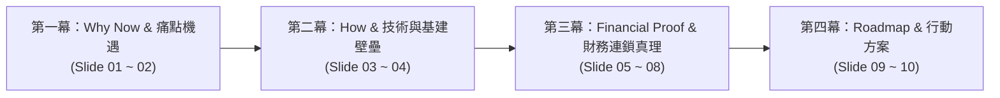

# 📑 Project Indo-Phoenix 商業計劃演示總綱架構規劃 (PITCH_DECK_BLUEPRINT.md)

> **文件定位**：本文件為 WebPPT 商業計劃演示頁之「內容架構真源設計圖」。  
> **使用工作流**：
> 1. 人類專案總監可在每一頁填寫 `[人類提供資料來源/文件/章節]` 與 `[人類精鍊指導意見]`。
> 2. AI 代理人依據指引提煉出「頂級投資人商業文案」與「數據指標」。
> 3. 確認文案精鍊無誤後，再進入前端 `presentation.html` 的視覺與互動實作。

---

## 🗺️ 總覽：頂級 CEO 商業路演四幕劇敘事架構

| 序號 | 模組 / 主題分類 | 投影片定位與核心目標 | 視覺圖表形態預想 | 狀態 |
| :---: | :--- | :--- | :--- | :---: |
| **01** | **執行摘要與願景** | 搶佔 China+1 歷史機遇，建立印度首座高階 FPC 樞紐 | 巨大核心營收發光卡 + 4 核心指標 | `待精煉` |
| **02** | **市場剛需與痛點破局** | 0% 本土競爭，48h 極速打樣 vs 傳統進口 3 週痛點對比 | 雙欄紅綠對比矩陣 (VS Matrix) | `待精煉` |
| **03** | **廠房基建與環保壁壘** | 13,000 m² 重工業濕製程佈局與 SPCB 零排放 (ZLD) 法規 | 空間面積磁貼 (Space Matrix Tiles) | `待精煉` |
| **04** | **AI / ACC 智慧工廠技術** | 導入 AI 閉環控制，徹底解決人工形變與濕製程良率問題 | 4 步水準智慧製造管線 (Pipeline Flow) | `待精煉` |
| **05** | **模組一：產能與產品營收** | 1L/2L/3L+ 產品配置，年產 18 萬 m²，年營收 $28.8M | 動態 SVG 甜甜圈環形圖 + 規格卡 | `待精煉` |
| **06** | **模組三：CapEx 資本支出** | 建廠 CapEx $23M 搭配 SPECS 25% 補貼，淨投 $17.25M | 資本支出多維對比與責任邊界駕駛艙 | `待精煉` |
| **07** | **模組四：OpEx 動態營運成本** | 單月 $1.845M OpEx，變動成本 69%，極強抗景氣循環 | 成本構成雙色比率圖 (Ratio Bars) | `待精煉` |
| **08** | **模組五：獲利與損益兩平** | BEP 50.8% 稼動率門檻，IRR 21.3%~24.8%，4.2年快速回本 | 科技半圓儀表盤 + 稼動率敏感度滑桿 | `待精煉` |
| **09** | **落地時程與放量里程碑** | T+6M 打樣 ➔ T+12M 損益平衡 ➔ T+24M 滿載放量 | 24 個月階段節點時間軸 (Roadmap) | `待精煉` |
| **10** | **策略合作與資料室** | 邀請戰略投資機構加入，申請投資人 Data Room 資料室 | 尊榮行動卡 (Call-To-Action Hub) | `待精煉` |

---

## 📑 逐頁架構與精煉工作區 (Slide-by-Slide Blueprint)

---

### 🌟 Slide 01：執行摘要與願景 (Executive Vision & Anchor)
- **【核心目標】**：開門見山給出全印第一的宏觀定位與最強核心數字，激發投資人熱情。
- **【目前擬定展示內容】**：
  - 主標題：印度首座戰略性航太與國防 FPC 智慧製造樞紐 (India's 1st Strategic Aerospace & Defense FPC Hub)
  - 核心數字：滿載年度營收規模 `$28.8M`（月產能 `15,000 m²`，加權均價 `$160/m²`）
  - 4 顆支撐指標：淨資本支出 `$17.25M`、EBIT 利潤率 `23.1%`、靜態回收期 `4.2 年`、IRR `21.3% ~ 24.8%`
- **📁【人類提供資料來源 / 參考文件】**：
  - `E:\Projects\Project Indo-Phoenix\印度FPC軟板智慧製造與自動化升級_投資意向報告.md`（第一章）
  - `線上 Google Sheet: FPC Factory Model!Module 1 & Module 5`
- **✍️【人類精鍊指導意見 / 補充想法】**：
  - *(在此輸入您對本頁內容、重點字句、強調方向的修改意見...)*
- **🤖【AI 精煉成果輸出（待填寫）】**：
  - *中文文案*：
  - *英文文案*：

---

### 🌟 Slide 02：市場剛需與痛點破局 (Market Opportunity & 48h Edge)
- **【核心目標】**：證明市場缺口巨大，進口痛點深，在地化無可取代。
- **【目前擬定展示內容】**：
  - 主標題：在地競爭 0% 空白與極速 48 小時打樣交期
  - 痛點對比：傳統跨國進口（3 週交期、+10~20% 關稅運費、地緣斷鏈風險）vs Indo-Phoenix（48~72h 在地打樣、0% 關稅、直通 Waaree 儲能與車載 Tier-1）
- **📁【人類提供資料來源 / 參考文件】**：
  - `E:\Projects\Project Indo-Phoenix\印度FPC軟板智慧製造與自動化升級_投資意向報告.md`（第二章、第三章）
- **✍️【人類精鍊指導意見 / 補充想法】**：
  - *(在此輸入您對本頁內容、重點字句、強調方向的修改意見...)*
- **🤖【AI 精煉成果輸出（待填寫）】**：
  - *中文文案*：
  - *英文文案*：

---

### 🌟 Slide 03：廠房基建與環保壁壘 (Plant Infrastructure & SPCB ZLD)
- **【核心目標】**：展現 13,000m² 實體工廠專業規劃，打消投資人對印度環境/法規/環評的疑慮。
- **【目前擬定展示內容】**：
  - 5 大空間磁貼：萬級無塵黃光區 (1,500m² / +40% HVAC)、濕製程化學區 (4,500m² / FRP 耐酸鹼)、微盲孔鑽孔區 (2,000m² / 隔震基座)、低溫材料倉 (2,000m² / 45-60天安全庫存)、廢水零排放 ZLD (3,000m² / 3倍標準面積)。
- **📁【人類提供資料來源 / 參考文件】**：
  - `線上 Google Sheet: FPC Factory Model!Module 2 (廠房面積與空間分配)`
- **✍️【人類精鍊指導意見 / 補充想法】**：
  - *(在此輸入您對本頁內容、重點字句、強調方向的修改意見...)*
- **🤖【AI 精煉成果輸出（待填寫）】**：
  - *中文文案*：
  - *英文文案*：

---

### 🌟 Slide 04：AI / ACC 閉環智慧製造架構 (AI Smart Factory)
- **【核心目標】**：說明如何用軟體與 AI 技術解決印度工人素質與濕製程良率問題。
- **【目前擬定展示內容】**：
  - 4 步水平智慧管線：台印雙軌物料 ➔ 萬級無塵 LDI 直接成像 ➔ AI 閉環 ACC/SFC 即時補償 ➔ 3,000m² ZLD 環保零排放。
- **📁【人類提供資料來源 / 參考文件】**：
  - `E:\Projects\Project Indo-Phoenix\印度FPC軟板智慧製造與自動化升級_投資意向報告.md`（第二章第 2 節）
- **✍️【人類精鍊指導意見 / 補充想法】**：
  - *(在此輸入您對本頁內容、重點字句、強調方向的修改意見...)*
- **🤖【AI 精煉成果輸出（待填寫）】**：
  - *中文文案*：
  - *英文文案*：

---

### 🌟 Slide 05：模組一：產能配置與動態產品營收 (Capacity & Revenue Model)
- **【核心目標】**：連貫展開財務真理的第一步——產品產銷結構與營收由來。
- **【目前擬定展示內容】**：
  - 左側：放大版 SVG 甜甜圈圖（1L 40% / 2L 50% / 3L+ 10%），中心顯示 `15,000 m²` 月產能與 `$28.8M` 年營收。
  - 右側：單面板 ($100/m² / 年$7.2M)、雙面板 ($180/m² / 年$16.2M / 鎖定車載CCS)、多層板 ($300/m² / 年$5.4M / 鎖定國防雷達)。
- **📁【人類提供資料來源 / 參考文件】**：
  - `線上 Google Sheet: FPC Factory Model!Module 1`
- **✍️【人類精鍊指導意見 / 補充想法】**：
  - *(在此輸入您對本頁內容、重點字句、強調方向的修改意見...)*
- **🤖【AI 精煉成果輸出（待填寫）】**：
  - *中文文案*：
  - *英文文案*：

---

### 🌟 Slide 06：模組三：CapEx 資本支出比較與 SPECS 補貼 (CapEx & SPECS Subsidy)
- **【核心目標】**：說明錢花在哪裡、台方責任邊界是什麼、政府如何提供 25% 安全墊。
- **【目前擬定展示內容】**：
  - 4 大分類行卡：生產測試設備 ($16.5M / 台方原廠 CEC 綠色通道驗機)、廠房與環保 ZLD ($3.5M / 設計規範輸出)、廠房無塵室 ($3.0M / 佈局與空調規範)、建廠總 CapEx ($23.0M ➔ SPECS -$5.75M ➔ 淨投 $17.25M)。
- **📁【人類提供資料來源 / 參考文件】**：
  - `線上 Google Sheet: FPC Factory Model!Module 3`
- **✍️【人類精鍊指導意見 / 補充想法】**：
  - *(在此輸入您對本頁內容、重點字句、強調方向的修改意見...)*
- **🤖【AI 精煉成果輸出（待填寫）】**：
  - *中文文案*：
  - *英文文案*：

---

### 🌟 Slide 07：模組四：動態單月營運成本結構 (Dynamic Monthly OpEx)
- **【核心目標】**：證明成本結構極具彈性，抗景氣循環能力極強。
- **【目前擬定展示內容】**：
  - 單月 OpEx `$1.845M`（年化 `$22.14M`），變動成本高達 `69.0%`。
  - 4 塊成本比例卡：直接材料 ($900K / 100%變動)、生產人工 ($430K / 40%變動)、水電能耗 ($265K / 75.7%變動)、固定資產折舊 ($250K / 100%固定)。
- **📁【人類提供資料來源 / 參考文件】**：
  - `線上 Google Sheet: FPC Factory Model!Module 4`
- **✍️【人類精鍊指導意見 / 補充想法】**：
  - *(在此輸入您對本頁內容、重點字句、強調方向的修改意見...)*
- **🤖【AI 精煉成果輸出（待填寫）】**：
  - *中文文案*：
  - *英文文案*：

---

### 🌟 Slide 08：模組五：獲利能力與損益兩平駕駛艙 (Profitability & BEP Cockpit)
- **【核心目標】**：財務模型的終極高潮——展現超額回報 (IRR 24.8%) 與極低損益平衡門檻 (50.8%)。
- **【目前擬定展示內容】**：
  - 左側：半圓動態指針 BEP `50.8%`（月營收門檻 `$1.22M`）+ 稼動率敏感度互動滑桿。
  - 右側：目標月營收 `$2.4M`、單月 OpEx `$1.845M`、營業利潤 EBIT `$555K (23.1%)`、損益平衡營收 `$1.22M`、IRR `21.3% ~ 24.8%`、靜態回收期 `4.2 年`。
- **📁【人類提供資料來源 / 參考文件】**：
  - `線上 Google Sheet: FPC Factory Model!Module 5`
- **✍️【人類精鍊指導意見 / 補充想法】**：
  - *(在此輸入您對本頁內容、重點字句、強調方向的修改意見...)*
- **🤖【AI 精煉成果輸出（待填寫）】**：
  - *中文文案*：
  - *英文文案*：

---

### 🌟 Slide 09：落地時程與放量里程碑 (Roadmap & Milestones)
- **【核心目標】**：清晰的 24 個月施工與量產爬坡路徑，交代每個階段的關鍵交付物。
- **【目前擬定展示內容】**：
  - `T+6M`：建廠、CEC 原廠驗機、客戶工程打樣
  - `T+12M`：產能爬坡至 70%，跨越 50.8% BEP 門檻，實現單月正現金流
  - `T+18M`：通過 IATF 16949 / AEC-Q 車規與國防供應商認證
  - `T+24M`：達到 95%+ 滿載運營，產出年營收 $28.8M
- **📁【人類提供資料來源 / 參考文件】**：
  - `E:\Projects\Project Indo-Phoenix\印度FPC軟板智慧製造與自動化升級_投資意向報告.md`（第四章第 2 節）
- **✍️【人類精鍊指導意見 / 補充想法】**：
  - *(在此輸入您對本頁內容、重點字句、強調方向的修改意見...)*
- **🤖【AI 精煉成果輸出（待填寫）】**：
  - *中文文案*：
  - *英文文案*：

---

### 🌟 Slide 10：策略合作與資料室 (Data Room CTA)
- **【核心目標】**：明確的 Call-to-Action，引導投資人簽署 NDA 並進入 Data Room 資料室。
- **【目前擬定展示內容】**：
  - 主標題：搶先佈局印度國防與新能源電子製造核心源頭 (Position Your Capital)
  - 核心按鈕：申請投資人資料室 (Request Investor Data Room Access) / 返回落地頁門戶
- **📁【人類提供資料來源 / 參考文件】**：
  - `E:\Projects\Project Indo-Phoenix\印度FPC軟板智慧製造與自動化升級_投資意向報告.md`
- **✍️【人類精鍊指導意見 / 補充想法】**：
  - *(在此輸入您對本頁內容、重點字句、強調方向的修改意見...)*
- **🤖【AI 精煉成果輸出（待填寫）】**：
  - *中文文案*：
  - *英文文案*：
