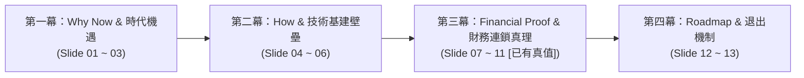

# 📑 Project Indo-Phoenix 商業計劃演示總綱架構與三大 AI 協同提示指引 (PITCH_DECK_BLUEPRINT.md)

> **🎯 本文件之戰略使命 (Mission Statement)**：  
> 本文件為 **Project Indo-Phoenix（印度首座高階航太、國防與車載 FPC 智慧製造樞紐）** 之 WebPPT 頂級商業路演總綱設計藍圖。  
> 專門作為 **人類專案總監與四大頂級大模型（ChatGPT、Claude、Gemini、Groq）協同之文案總成與架構真源（SSOT Master Blueprint）**。

---

## 🏛️ 專案靈魂定位：站在「印度高種姓愛國實業家族 (Promoter) ✕ 國家補貼巨頭」視角

1. **家國情懷與國家戰略紅利**：
   - 乘載「印度製造 (Make in India)」、「國防自主 (Atmanirbhar Bharat)」與全球「China+1」歷史窗口。
   - 破除官方「30% 自給率」統計陷阱（印度高階 FPC 前製程化學濕製程**實質為 0%**，100% 依賴進口斷鏈）。
2. **極致的政商利益與國家補貼變現**：
   - 直通政府 **SPECS 25% 官方現金補貼返還（$5.75M 安全墊）**。
   - 提升下游組裝廠 **35%+ 在地價值增值 (DVA)**，助力 Tata、Motherson、Ola 拿滿國家 **PLI 增量補貼**。
   - 鎖定國防相抵（Defense Offset）**5~7 倍超額暴利**（符合 DAP 2020 政策強制 30%~50% 在地採購）。
3. **絕對安全的股權治理結構**：
   - **印度實業大股東絕對控股（>90%）**，台灣頂級技術團隊僅索取 **5% 技術汗水股（Sweat Equity）**。
   - 台灣團隊簽署競業禁止集體離職全職投入，個人職業生涯與 **85%~95% 爬坡良率終身對賭**。
4. **神聖財務真源連鎖反應**：
   - 滿載年營收 **$28.80M**（月產能 15,000 m²，加權單價 $160/m²）
   - 總 CapEx **$23.00M** ➔ SPECS 補貼返還 **-$5.75M** ➔ 淨 CapEx **$17.25M**
   - 單月 OpEx **$1.845M**（變動成本高達 **69.0%**，折舊僅 13.6%，極強抗景氣循環）
   - 損益兩平點 (BEP) 僅 **50.8%**（單月門檻 $1.22M），EBIT 利潤率 **23.1%**（年化 $6.66M），IRR **21.3%~24.8%**，**4.2 年回本**。

---

## 🗺️ 總覽：頂級 CEO 商業路演 13 頁四幕劇敘事矩陣 (13-Slide Master Matrix)

| 頁碼 | 模組 / 主題分類 | 投影片定位與核心目標 | 視覺圖表形態 | 數據狀態 |
| :---: | :--- | :--- | :--- | :---: |
| **01** | **執行摘要與願景** | 破除 30% 自給率假象：搶佔全印首座高階 FPC 前製程「絕對真空」 | 巨大發光年營收卡 + 4 核心指標 | `[已有真值]` |
| **02** | **市場剛需與痛點破局** | 0% 在地競爭真空 × 48 小時極速打樣：終結 3 週跨國斷鏈痛點 | 雙欄紅綠對比矩陣 (VS Matrix) | `[文案定稿]` |
| **03** | **三大剛需賽道真實買家** | 訂單不是猜的，是點名的：手握數十億美元剛性採購池 (Tata/Waaree/Adani) | 3 大垂直產業客群卡片 + 浮動名冊 | `[文案定稿]` |
| **04** | **技術股 5 大核心護城河** | 5% 技術汗水股讓利：印度大股東絕對控股 >90%，對賭 SpaceX 級良率 | 4 大護城河卡片 (Vendor Code/認證) | `[文案定稿]` |
| **05** | **Edge AI 智慧工廠壁壘** | AI / ACC 智慧工廠：徹底免疫「人員流失、技術清零」魔咒 | 3 大 AI 技術賦能卡 (ACC/AR/LLM) | `[文案定稿]` |
| **06** | **廠房基建與 SPCB 環保** | 13,000 m² 專業重工廠房：3 倍標準 ZLD 築起印度最高環評特許門檻 | 空間面積磁貼 (Space Matrix Tiles) | `[已有真值]` |
| **07** | **【模組一】產能與營收** | 高密度產品組合 (1L/2L/3L+)：年產 18 萬 m² 鎖定 $28.80M 年營收 | 動態 SVG 甜甜圈環形圖 + 規格卡 | `[已有真值]` |
| **08** | **【模組二】空間分區標準** | 13,000 m² 廠房面積與 5 大功能區配置規格標準（重工/防震/冷藏） | 5 大分區規格矩陣與佈局說明 | `[已有真值]` |
| **09** | **【模組三】CapEx 資本支出** | 建廠總 CapEx $23M 搭配 SPECS 25% 返還：淨投 $17.25M 責任邊界駕駛艙 | 4 欄對比駕駛艙 + 台方工程邊界 | `[已有真值]` |
| **10** | **【模組四】OpEx 動態營運** | 單月 OpEx $1.845M：變動成本 69.0%，極強抗景氣循環韌性 | 4 大成本雙色比率圖 (Ratio Bars) | `[已有真值]` |
| **11** | **【模組五】獲利與損益兩平** | 損益兩平點 50.8% ($1.22M/月)：EBIT 23.1%、IRR 24.8%、4.2 年回本 | 科技半圓儀表盤 + 敏感度滑桿 | `[已有真值]` |
| **12** | **落地時程與放量里程碑** | 階段性爬坡時程：T+6M 打樣 ➔ T+12M BEP 盈利 ➔ T+24M 滿載放量 | 4 步 24 個月放量時間軸 (Roadmap) | `[文案定稿]` |
| **13** | **策略合作方案與資料室** | 邀請戰略機構簽署 NDA：開放專屬投資人 Data Room 資料室 | 尊榮行動號召卡 (CTA Hub) | `[文案定稿]` |

---

## 📑 逐頁終極精煉文案母稿 (Slide-by-Slide Refined Master Copy)

---

### 🌟 Slide 01：執行摘要與國家戰略定位 (Executive Summary & Strategic Vision)
- **【主標題】**：破除 30% 自給率假象：搶佔全印首座高階 FPC 前製程「絕對真空」
- **【副標題】**：專注 35%~40% 高毛利裸板製造，承接全球 China+1 歷史性產業轉移窗口
- **【核心願景】**：在印度高階軟板（FPC）裸板前製程自給率實質為 0% 的歷史節點，建立全印首座航太、國防與車載級智慧製造樞紐，以高毛利裸板前製程填補國家戰略空白，打造高壁壘、高現金流的上市平台。
- **【三大核心論點】**：
  1. **自給率是假象**：現有 30%~35% 本土產能全數集中於低階單雙面硬板（家電/LED 燈條），代表高精密度的高階 FPC 化學濕製程裸板本土製造為 0%，100% 依賴進口。
  2. **去 SMT 化專注高毛利裸板**：主動剔除主被動晶片採購，規避庫存跌價與壞帳風險；鎖定 35%~40% 綜合毛利率，直攻上游最肥沃製造利潤。
  3. **極致穩健的財務底盤**：滿載年營收 $28.80M、EBIT 利潤率 23.1%、享政府 SPECS 補貼後淨 CapEx 僅 $17.25M，4.2 年即可收回全部投資。
- **【高管決策一句話】**：*「這不是一場低階組裝價格戰，而是一次在 0% 競爭的真空市場中，以國家級首發優勢鎖定高毛利製造霸權的戰略卡位。」*

---

### 🌟 Slide 02：市場剛需與痛點破局 (Market Opportunity & 48h Edge)
- **【主標題】**：0% 在地競爭真空 × 48 小時極速打樣：終結 3 週跨國斷鏈痛點
- **【副標題】**：打通印度車載、國防與消費電子在地化供應動脈，重塑供應鏈響應時效
- **【雙欄直觀對比 (VS Matrix)】**：
  - **🔴 傳統海外進口三大死穴**：
    - 工程打樣 3~5 週：越洋往返改模，拖垮客戶新品上市時效。
    - 成本與庫存積壓：24%~46% 關稅倒掛與空運費，疊加 45~60 天在途安全庫存佔用巨額現金流。
    - 地緣政治斷鏈風險：海關查驗延宕動輒數月，組裝廠 DVA 停滯在 15~20% 面臨政策扣減。
  - **🟢 Indo-Phoenix 在地化三大殺手鐧**：
    - 48~72 小時極速打樣：本土即時工程對接，3~5 天量產 JIT 廠邊直送。
    - 0% 關稅與雙軌成本防禦：基礎原料 100% 本地採購，享有 MOOWR 保稅與東協 FTA 免稅。
    - 助力客戶拿滿 PLI 補貼：直接提升客戶 35%+ 在地價值 (DVA)，直通印度 Tier-1 供應鏈。
- **【高管決策一句話】**：*「我們賣的不是產品，是『時間』與『確定性』——幫客戶一次拿回上市速度、現金流與國家 PLI 增量補貼。」*

---

### 🌟 Slide 03：三大剛需賽道真實買家 (Target Market & 5 Verticals)
- **【主標題】**：訂單不是猜的，是點名的：三大剛性賽道、真實買家名單
- **【副標題】**：對標 2026 印度 $1.06B~$1.30B FPC 市場，年需求超 3.5 億片剛性採購池
- **【三大核心剛需客群】**：
  1. **新能源與儲能 CCS（大尺寸電芯採樣軟板）**：
     - 對標巨頭：**Tata AutoComp (TACO)、Waaree Energy、Ola Electric、Exide Energy、Amara Raja**。
     - 需求：EV 與儲能 Pack 全面以 CCS 替代笨重線束；需超長厚銅（2~12oz）耐溫軟板（-40°C~+125°C）。全印 90%+ 依賴進口。
  2. **車載 Tier-1 電子（高可靠度車規級線束）**：
     - 對標巨頭：**Samvardhana Motherson、Bosch India、Uno Minda、Tata Motors、Mahindra**。
     - 需求：ADAS 多鏡頭、雷達、數位座艙與 LED 矩陣車燈；單車需超 100 種 FPC，必須通過 IATF 16949 / AEC-Q100 認證。
  3. **航太與國防軍規相抵（Defense Offset 5~7倍暴利）**：
     - 對標巨頭：**TASL、Adani Defence、L&T、ideaForge、Raphe mPhibr (B輪1億美元排斥中國零件)、ISRO、HAL**。
     - 需求：DAP 2020 強制 30%~50% 在地採購；Indo-Phoenix 為全印唯一符合 IPC Class 3 / AS9100 實體，享有極高毛利。
- **【高管決策一句話】**：*「下游巨頭為滿足政府國產化與 PLI 考核急需在地供應商，採購名單全部到位，我們是在挑選最高毛利的訂單。」*

---

### 🌟 Slide 04：技術股 5 大核心護城河 (Top 5 Technology Moats)
- **【主標題】**：印度資本絕對控股 >90%：台灣技術團隊以 5% 讓利對賭 SpaceX 級良率
- **【副標題】**：成熟量產體系毫無偏差整廠移植，打破國際材料配額封鎖與體系認證高牆
- **【四大核心護城河】**：
  1. **5% Sweat Equity 商業法理**：台灣核心高管集體承擔競業法律風險全職投入；讓利印度大股東絕對控股（>90%），將股權與 85%~95% 爬坡良率終身對賭。
  2. **突破國際 Vendor Code 壁壘**：直接沿用數十年原廠信任基礎，取得杜邦（DuPont）、台虹（Taiflex）、松下（Panasonic）高階 FCCL 與 PI 配額及優惠帳期，打破新廠現金預付封鎖。
  3. **Copy Exactly 精確工藝複製**：成熟機台參數、化學藥水配方（DES 線、黑孔化、垂直連續電鍍 VCP）無偏差輸出，壓縮 2 年試錯期。
  4. **全套國際體系認證接單能力**：一次性建立並輔導通過 IATF 16949（車規）、AS9100（航太）、ISO 26262 及 IPC Class 3 認證，賦予工廠最高等級接單硬實力。
- **【高管決策一句話】**：*「大股東持有超過 90% 股權與實體資產，技術團隊用職業生涯對賭 90%+ 良率，這是利益極致捆綁的最優合資治理架構。」*

---

### 🌟 Slide 05：Edge AI / ACC 智慧工廠技術壁壘 (AI Smart Factory)
- **【主標題】**：AI / ACC 智慧工廠體系：徹底免疫「人員流失、技術清零」魔咒
- **【副標題】**：邊緣閉環毫秒補償與 AR 動態防呆，將數十年老師傅經驗固化為數位資產
- **【三大 AI 技術賦能支柱】**：
  1. **毫秒級邊緣閉環控制 (Edge ACC)**：產線部署 PolarFire SoC 邊緣運算節點，微米級即時捕捉製程微觀偏移，並在批量報廢發生前，自動向曝光機/鑽孔機發送伺服補償指令。
  2. **AR 智慧眼鏡與動態 SOP**：印度作業員配戴 AR 眼鏡進行動態防呆（Poka-yoke）視覺指引，實時追蹤操作動作，將人員培訓週期由 2 週大幅壓縮至 4 小時。
  3. **工業專家大腦 (LLM / RAG 知識庫)**：每一次排障經驗即時轉化為可對話的工業大模型專家庫，工藝資產 100% 在地留存，徹底打破「工程師一走、工廠癱瘓」的魔咒。
- **【高管決策一句話】**：*「我們用 AI 演算法與硬體防呆接管了品質控制，讓精密製造不再依賴不可控的人工熟練度，實現良率自動自癒。」*

---

### 🌟 Slide 06：廠房基建規劃與 SPCB 環保壁壘 (Infrastructure & ZLD)
- **【主標題】**：13,000 m² 專業重工廠房：3 倍標準 ZLD 築起印度最高環評門檻
- **【副標題】**：高冗餘暖通、隔震地基與 100% 廢水循環回用，確保產線永不停工
- **【四大基建與工程亮點】**：
  1. **+40% HVAC 暖通冗餘設計**：專門針對印度夏季 45°C+ 極端高溫設計，確保萬級黃光曝光區恆溫恆濕與 LDI 成像精度。
  2. **FRP 重防腐地坪與負壓管溝**：全區化學濕製程鋪設重防腐玻璃鋼與雙層耐腐管溝，配備酸霧洗滌塔，確保一次性通過 SPCB 紅色重污染審查。
  3. **獨立主動隔震深地基**：微孔雷射鑽孔區獨立鋪設重型隔震基座，徹底隔絕周邊重工震動，確保 2 mil 微盲孔良率。
  4. **3,000 m² ZLD 廢水零排放專區**：佔地達傳統 3 倍，整合 MVR 多效蒸發與 RO 逆滲透，重金屬與化學廢水 100% 廠內循環，徹底免除地方環保局突擊停工風險。
- **【高管決策一句話】**：*「在印度，環評牌照就是最大的特許經營權；3,000 平方米的零排放系統是我們合法持續量產的終極防禦工事。」*

---

### 🌟 Slide 07 ~ 11：【神聖五大財務模型連鎖驗證】（純數字真理區）
- **Slide 07【模組一：產能與營收模型】**：月產 15,000 m²，年產 180,000 m²，1L(40%)/2L(50%)/3L+(10%)，加權單價 $160/m²，年營收 **$28.80M**。
  - *決策解讀：高密度產品組合精準卡位車載與國防高毛利市場，雙班滿載年產值穩健釋放。*
- **Slide 08【模組二：廠房空間分區標準】**：總面積 13,000 m²（黃光 1,500m²、濕製程 4,500m²、鑽孔壓合 2,000m²、冷藏倉 2,000m²、ZLD 3,000m²）。
  - *決策解讀：嚴格按國際濕製程與印度在地法規規劃，5 大專區空間無縫承載 15,000 m²/月之高效產出。*
- **Slide 09【模組三：CapEx 資本支出與 SPECS 補貼】**：設備 $16.5M、環保 $3.5M、廠房 $3.0M ➔ 總 CapEx **$23.0M** ➔ SPECS 25% 返還 **-$5.75M** ➔ 淨 CapEx **$17.25M**。
  - *決策解讀：SPECS 25% 官方現金補貼提供 575 萬美元安全防線，台方團隊把控原廠 CEC 綠色通道驗機。*
- **Slide 10【模組四：OpEx 動態單月營運成本】**：單月 OpEx **$1.845M**（年化 $22.14M），變動成本佔比 **69.0%** ($1.27M/月)，折舊佔比僅 13.6%。
  - *決策解讀：高達 69% 的變動成本結構與低固定折舊，賦予工廠極強的抗景氣循環避險能力。*
- **Slide 11【模組五：獲利能力與損益兩平駕駛艙】**：BEP 僅 **50.8%**（單月門檻 **$1.22M**），滿載單月 EBIT **$555K** (EBIT 利潤率 **23.1%**，年化 EBIT **$6.66M**)，IRR **21.3%~24.8%**，靜態投資回收期 **4.2 年**。
  - *決策解讀：產能稼動過半即刻產生淨現金流，超額 IRR 與 4.2 年回本期展現卓越的資本效率。*

---

### 🌟 Slide 12：落地放量時程與階段里程碑 (Roadmap & Milestones)
- **【主標題】**：24 個月放量路徑圖：T+12M 跨越損益平衡，實現規模淨獲利
- **【副標題】**：嚴格的階段關卡治理，確保設備進場、客戶認證與產能爬坡精確受控
- **【四大里程碑】**：
  1. `T + 6M`（建廠與打樣認證）：潔淨室竣工、CEC 原廠驗機進廠、通過首批客戶工廠審核。
  2. `T + 12M`（規模量產 70%）：產能跨越 50.8% BEP 門檻，實現單月正現金流獲利。
  3. `T + 18M`（國際車規認證）：取得 IATF 16949 / AEC-Q100 及航太 AS9100 認證，全面承接車載 Tier-1 訂單。
  4. `T + 24M`（滿載運營 95%+）：實現年營收 $28.8M，並啟動 AI 智慧工廠 SaaS 解決方案輸出。
- **【高管決策一句話】**：*「每一個里程碑都有明確的交付物與風控檢查點，確保資本投入每一分錢都轉化為確定性的產能。」*

---

### 🌟 Slide 13：策略合作方案與投資人資料室 (Data Room CTA)
- **【主標題】**：將您的資本，佈局在印度國防與高階電子供應鏈的最起點
- **【副標題】**：印度大股東絕對控股 >90%、政府政策全力護航，邀請戰略投資機構加入
- **【行動方案】**：
  1. **股權架構**：大股東掌控 >90% 股權與實體資產，技術團隊持 5% 股權終身對賭良率。
  2. **開放資料室**：簽署 NDA 後即刻開放投資人 Data Room（含完整財務底稿、設備原廠清單、SPCB 環評方案）。
- **【核心按鈕】**：`申請投資人資料室 (Request Investor Data Room Access)` / `返回落地頁總覽`

---

## 📑 逐頁架構與精煉工作區 (Slide-by-Slide Refinement Prompts)

---

### 🌟 Slide 01：執行摘要與國家戰略定位 (Executive Summary & Strategic Vision)
- **【核心目標】**：破除「30% 自給率」統計陷阱，點出高階 FPC 前製程的國家級「絕對真空」，激發投資人熱情。
- **【數據狀態】**：`[財務真源：已有精確建模，嚴禁捏造]`（年營收 $28.8M / 淨 CapEx $17.25M / EBIT 23.1% / 回收期 4.2 年）。
- **📁【指定參考附件】**：
  - [`執行摘要與願景.md`](file:///E:/Projects/Project Indo-Phoenix/%E5%9F%B7%E8%A1%8C%E6%91%98%E8%A6%81%E8%88%87%E9%A1%98%E6%99%AF.md)（章節 1.1、1.2、1.3）
- **🤖【請外部 AI 提煉輸出（Prompt to ChatGPT / Claude / Gemini）】**：
  > 請依據上述參考文件，為 Slide 01 提煉：
  > 1. 一句震撼人心的**主標題**（突出全印首座、破除統計陷阱）。
  > 2. 一段 80 字內的**核心願景陳述**。
  > 3. 3 個核心支撐論點：(A) 為什麼現有自給率是假象？(B) 為什麼專注高毛利裸板前製程？(C) 鎖定 35%~40% 綜合毛利率的戰略意義。

---

### 🌟 Slide 02：市場剛需與痛點破局 (Market Opportunity & 48h Edge)
- **【核心目標】**：用最強烈的大白話對比「跨國進口 3 週斷鏈痛點」與「Indo-Phoenix 48 小時在地交付優勢」。
- **【數據狀態】**：`[需外部 AI 提煉核心文案]`。
- **📁【指定參考附件】**：
  - [`市場剛需與痛點破局.md`](file:///E:/Projects/Project Indo-Phoenix/%E5%B8%82%E5%A0%B4%E5%89%9B%E9%9C%80%E8%88%87%E7%97%9B%E9%93%9e%E7%A0%B4%E5%B1%80.md)
  - [`執行摘要與願景.md`](file:///E:/Projects/Project Indo-Phoenix/%E5%9F%B7%E8%A1%8C%E6%91%98%E8%A6%81%E8%88%87%E9%A1%98%E6%99%AF.md)（第 02 章）
- **🤖【請外部 AI 提煉輸出】**：
  > 請提煉為「雙欄直觀對比（VS Matrix）」形式：
  > 1. **左欄（傳統跨國進口三大死穴）**：打樣 3 週交期、+10~20% 關稅與空運運費、外匯地緣斷鏈風險。
  > 2. **右欄（Indo-Phoenix 在地化三大殺手鐧）**：48~72h 極速打樣響應、基礎耗材 100% 本地採購零關稅、直通印度 Tier-1 供應鏈。

---

### 🌟 Slide 03：五大剛需賽道與精準客群 (Target Market & 5 Verticals)
- **【核心目標】**：列出精準客戶清單與爆發賽道，證明訂單來源真實可靠。
- **【數據狀態】**：`[需外部 AI 提煉核心文案]`（2026 印度 FPC 總量預估 $496M ~ $1.06B）。
- **📁【指定參考附件】**：
  - [`印度 CCS FPCBA 產業與需求企業深度研究報告.md`](file:///E:/Projects/Project Indo-Phoenix/%E5%8D%B0%E5%BA%A6%20CCS%20FPCBA%20%E7%94%A2%E6%A5%AD%E8%88%87%E9%9C%80%E6%B1%82%E4%BC%81%E6%A5%AD%E6%B7%B1%E5%BA%A6%E7%A0%94%E7%A9%B6%E5%A0%B1%E5%91%8A.md)
  - [`印度車用電子 FPCBA 產業與需求企業深度研究報告.md`](file:///E:/Projects/Project Indo-Phoenix/%E5%8D%B0%E5%BA%A6%E8%BB%8A%E7%94%A8%E9%9B%BB%E5%AD%90%20FPCBA%20%E7%94%A2%E6%A5%AD%E8%88%87%E9%9C%80%E6%B1%82%E4%BC%81%E6%A5%AD%E6%B7%B1%E5%BA%A6%E7%A0%94%E7%A9%B6%E5%A0%B1%E5%91%8A.md)
  - [`印度國防與航太FPC目標客戶清單.md`](file:///E:/Projects/Project Indo-Phoenix/%E5%8D%B0%E5%BA%A6%E5%9C%8B%E9%98%B2%E8%88%87%E8%88%AA%E5%A4%AAFPC%E7%9B%AE%E6%A8%99%E5%AE%A2%E6%88%B6%E6%B8%85%E5%96%AE.md)
- **🤖【請外部 AI 提煉輸出】**：
  > 請提煉 3 大核心剛需客群畫像：
  > 1. **新能源與儲能 CCS**：Waaree Energy、Tata Power 大尺寸電池採集軟板替代線束。
  > 2. **車載 Tier-1 電子**：Tata Motors、Mahindra、Ola Electric 儀表與 ADAS 感測線束（過 IATF 16949）。
  > 3. **航太與國防軍規**：ISRO、HAL、DRDO 無人機與相控陣雷達多層剛撓結合板（IPC Class 3）。

---

### 🌟 Slide 04：技術股 5 大核心護城河 (Top 5 Technology Moats)
- **【核心目標】**：說明台灣頂級技術團隊為何能成功移植技術，讓印度大股東絕對放心。
- **【數據狀態】**：`[需外部 AI 提煉核心文案]`（5% 技術汗水股 / 印度股東持股 >90%）。
- **📁【指定參考附件】**：
  - [`技術股核心優勢、職責清單與邊界戰略白皮書.md`](file:///E:/Projects/Project Indo-Phoenix/%E6%8A%80%E8%A1%93%E8%82%A1%E6%A0%B8%E5%BF%83%E5%84%AA%E5%8B%A2%E3%80%81%E8%81%B7%E8%B2%AC%E6%B8%85%E5%96%AE%E8%88%87%E9%82%8A%E7%95%8C%E6%88%B0%E7%95%A5%E7%99%BD%E7%9A%AE%E6%9B%B8.md)（第 01、02 章）
- **🤖【請外部 AI 提煉輸出】**：
  > 請提煉 4 點核心優勢：
  > 1. **5% Sweat Equity 商業法理**：讓利實業股東控股，個人職業與良率（85%~95%）終身對賭。
  > 2. **突破國際 Vendor Code 壁壘**：直取杜邦、台虹、松下核心材料配額與優惠帳期。
  > 3. **Copy Exactly 精確複製工藝**：成熟機台參數、VCP/DES/黑孔化配方無偏差整廠輸出。
  > 4. **國際體系接單認證**：IATF 16949、AS9100、ISO 26262、IPC Class 3 一次性過審能力。

---

### 🌟 Slide 05：Edge AI / ACC 智慧工廠技術壁壘 (AI Smart Factory)
- **【核心目標】**：用軟體與 AI 技術徹底打消投資人對「印度工人素質低、人員流失導致技術清零」的刻板印象。
- **【數據狀態】**：`[需外部 AI 提煉核心文案]`。
- **📁【指定參考附件】**：
  - [`技術股核心優勢、職責清單與邊界戰略白皮書.md`](file:///E:/Projects/Project Indo-Phoenix/%E6%8A%80%E8%A1%93%E8%82%A1%E6%A0%B8%E5%BF%83%E5%84%AA%E5%8B%A2%E3%80%81%E8%81%B7%E8%B2%AC%E6%B8%85%E5%96%AE%E8%88%87%E9%82%8A%E7%95%8C%E6%88%B0%E7%95%A5%E7%99%BD%E7%9A%AE%E6%9B%B8.md)（章節 2.5）
- **🤖【請外部 AI 提煉輸出】**：
  > 請提煉 3 大 AI 技術賦能亮點：
  > 1. **毫秒級邊緣閉環控制 (Edge ACC)**：PolarFire SoC 節點即時缺陷捕捉與伺服補償，杜絕批量報廢。
  > 2. **AR 智慧眼鏡與動態 SOP**：動態防呆 (Poka-yoke) 指引，培訓期由 2 週縮短至 4 小時。
  > 3. **工廠專家大腦 (LLM/RAG)**：工程排障日誌化為可對話專家系統，技術 100% 在地固化。

---

### 🌟 Slide 06：廠房基建規劃與 SPCB 環保壁壘 (Infrastructure & ZLD)
- **【核心目標】**：展現 13,000 m² 實體工廠專業佈局，證明具備通過印度環評 (SPCB) 之硬實力。
- **【數據狀態】**：`[財務真源：已有精確建模，嚴禁捏造]`（總面積 13,000 m² / ZLD 3,000 m²）。
- **📁【指定參考附件】**：
  - `線上 Google Sheet / Excel: FPC Factory Model!Module 2`
  - [`技術股核心優勢、職責清單與邊界戰略白皮書.md`](file:///E:/Projects/Project Indo-Phoenix/%E6%8A%80%E8%A1%93%E8%82%A1%E6%A0%B8%E5%BF%83%E5%84%AA%E5%8B%A2%E3%80%81%E8%81%B7%E8%B2%AC%E6%B8%85%E5%96%AE%E8%88%87%E9%82%8A%E7%95%8C%E6%88%B0%E7%95%A5%E7%99%BD%E7%9A%AE%E6%9B%B8.md)（職責邊界）
- **🤖【請外部 AI 提煉輸出】**：
  > 請提煉 4 點工程基建亮點：
  > 1. **+40% HVAC 暖通容量**：專門克服印度夏季 45°C+ 極端高溫環境。
  > 2. **FRP 耐酸鹼重防腐地坪**：配備負壓酸霧洗滌塔，確保順利通過 SPCB 環評。
  > 3. **獨立隔震深地基**：隔絕微震動，保障雷射微盲孔鑽孔良率。
  > 4. **ZLD 廢水零排放專區 (3,000 m²)**：佔地達傳統 3 倍，法定綠色專案必備設施。

---

### 🌟 Slide 07 ~ 11：【神聖五大財務模型連鎖驗證】（純數字真理區）
> [!NOTE]
> **【此 5 頁全部標註：已有精確建模，嚴禁外部 AI 捏造或修改數字】**  
> 外部 AI 只需針對各頁的數值輸出 1 句精煉的「**投資人決策白話解讀**」即可！

- **Slide 07【模組一：產能與營收模型】**：`[已有真值]`
  - 數值：月產 `15,000 m²`，年產 `180,000 m²`，1L(40%)/2L(50%)/3L+(10%)，加權單價 `$160/m²`，年營收 **`$28.80M`**。
  - AI 提煉方向：一句話總結高密度產品組合與年化 $28.8M 的放量邏輯。
- **Slide 08【模組二：廠房空間分區標準】**：`[已有真值]`
  - 數值：總面積 `13,000 m²`（黃光 1,500m²、濕製程 4,500m²、鑽孔壓合 2,000m²、冷藏倉 2,000m²、ZLD 3,000m²）。
  - AI 提煉方向：一句話說明 13,000 m² 空間如何精準承載 15,000 m²/月之產能。
- **Slide 09【模組三：CapEx 資本支出與 SPECS 補貼】**：`[已有真值]`
  - 數值：設備 `$16.5M`、環保 `$3.5M`、廠房 `$3.0M` ➔ 總 CapEx **`$23.0M`** ➔ SPECS 25% 現金返還 **`-$5.75M`** ➔ 淨 CapEx **`$17.25M`**。
  - AI 提煉方向：一句話解讀 25% 官方現金補貼為投資人建立的 575 萬美元安全防禦墊。
- **Slide 10【模組四：OpEx 動態單月營運成本】**：`[已有真值]`
  - 數值：單月 OpEx **`$1.845M`**（年化 `$22.14M`），變動成本佔比 **`69.0%`** ($1.27M/月)，折舊佔比僅 `13.6%`。
  - AI 提煉方向：一句話解讀高變動成本比率（69%）在景氣循環中帶來的極強避險抗震性。
- **Slide 11【模組五：獲利能力與損益兩平駕駛艙】**：`[已有真值]`
  - 數值：損益兩平點 (BEP) **`50.8%`**（單月營收門檻 **`$1.22M`**），滿載單月 EBIT **`$555K`** (EBIT 利潤率 **`23.1%`**，年化 EBIT **`$6.66M`**)，IRR **`21.3% ~ 24.8%`**，靜態投資回收期 **`4.2 年`**（無補貼 5.2 年）。
  - AI 提煉方向：一句話解讀 50.8% 稼動率即跨入淨獲利之高安全邊際與 24.8% IRR 超額回報。

---

### 🌟 Slide 12：落地放量時程與階段里程碑 (Roadmap & Milestones)
- **【核心目標】**：給出清晰可信的 24 個月投產爬坡路徑。
- **【數據狀態】**：`[需外部 AI 提煉核心文案]`。
- **📁【指定參考附件】**：
  - [`執行摘要與願景.md`](file:///E:/Projects/Project Indo-Phoenix/%E5%9F%B7%E8%A1%8C%E6%91%98%E8%A6%81%E8%88%87%E9%A1%98%E6%99%AF.md)（第 04 章）
  - [`印度FPC軟板智慧製造與自動化升級_投資意向報告.md`](file:///E:/Projects/Project Indo-Phoenix/%E5%8D%B0%E5%BA%A6FPC%E8%BB%9F%E6%9D%BF%E6%99%BA%E6%85%A7%E8%A3%BD%E9%80%A0%E8%88%87%E8%87%AA%E5%8B%95%E5%8C%96%E5%8D%87%E7%B4%9A_%E6%8A%95%E8%B3%87%E6%84%8F%E5%90%91%E5%A0%B1%E5%91%8A.md)（章節 4.2）
- **🤖【請外部 AI 提煉輸出】**：
  > 請提煉 4 大關鍵節點：
  > 1. `T + 6M`（建廠與工程打樣）：潔淨室竣工、CEC 原廠驗機、通過首批客戶工廠審核。
  > 2. `T + 12M`（規模量產 70%）：跨越 50.8% BEP 門檻，實現單月正現金流。
  > 3. `T + 18M`（國際車規認證）：取得 IATF 16949 / AEC-Q100 及航太 AS9100 認證。
  > 4. `T + 24M`（滿載 95%+）：實現年營收 $28.8M，啟動智慧工廠 SaaS 解決方案輸出。

---

### 🌟 Slide 13：策略合作方案與投資人資料室 (Data Room CTA)
- **【核心目標】**：發起明確的行動號召，引導戰略投資人簽署 NDA 申請進入 Data Room。
- **【數據狀態】**：`[需外部 AI 提煉核心文案]`。
- **📁【指定參考附件】**：
  - [`技術股核心優勢、職責清單與邊界戰略白皮書.md`](file:///E:/Projects/Project Indo-Phoenix/%E6%8A%80%E8%A1%93%E8%82%A1%E6%A0%B8%E5%BF%83%E5%84%AA%E5%8B%A2%E3%80%81%E8%81%B7%E8%B2%AC%E6%B8%85%E5%96%AE%E8%88%87%E9%82%8A%E7%95%8C%E6%88%B0%E7%95%A5%E7%99%BD%E7%9A%AE%E6%9B%B8.md)（第 01 章）
- **🤖【請外部 AI 提煉輸出】**：
  > 請提煉 1 份尊榮邀請文案：
  > 1. 強調 JV 合資公司架構優勢（印度大股東絕對控股 >90%、技術團隊對賭良率）。
  > 2. 邀請簽署 NDA，開放投資人專屬資料室（Data Room：包含完整財務底稿、設備報價單、SPCB 環評申報書）。
