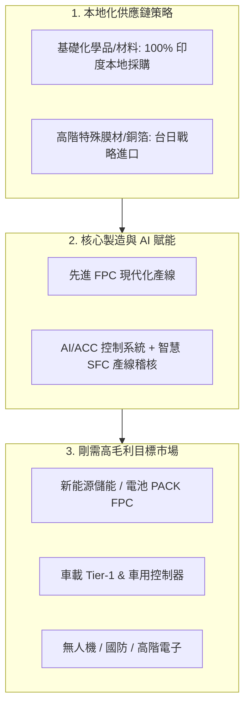

# 🚀 印度先進 FPC（軟性印刷電路板）智慧製造與自動化升級投資意向報告
> **Executive Summary & Investment Teaser for Prospective Strategic Investors**  
> **編制日期**：2026 年 8 月  
> **專案代號**：Project Lotus-FPC / Next-Gen Automation  

---

## 📌 一、 執行摘要 (Executive Summary)

本專案旨在掌握**「印度製造 (Make in India)」政策紅利**與**全球供應鏈去風險化（China+1）**之歷史機遇，於印度建立**全印度最具技術競爭力、高度智慧自動化（AI/ACC/SFC）之先進 FPC（軟性印刷電路板）量產製造廠**。

傳統 EMS/PCB 工廠高度依賴大量密集人工與低效產線，本專案將導入**新一代 AI 控制架構與自動化控制系統（ACC / SFC 智慧製造系統）**，大幅降低不良率與人工依賴，並結合本地化原材料供應鏈與財務墊資優勢，為**新能源儲能/太陽能（如 Waaree）、車載 Tier-1（Tesla/Toyota/Tata 供應鏈）、無人機及高階消費性電子**提供「印度本地設計、快速打樣、高毛利量產」的一站式解決方案。



---

## 🎯 二、 投資亮點與核心競爭優勢 (Key Investment Highlights)

### 1. 🇮🇳 印度本地化 100% 剛需與政策紅利
* **填補印度軟板高端產能空白**：印度本地缺乏成熟、具車規與新能源認證的高階 FPC 供應商，目前大部分組件依賴進口。
* **關稅防禦與交期優勢**：本地設廠可省去 10%~20% 關稅與高昂航空海運時間，工程打樣響應時間由原本跨國寄送的 2~3 週縮短至 **48~72 小時**。

### 2. 🤖 顛覆性 AI / ACC 自動化控制系統（超越傳統 EMS 效率）
* **全製程 AI 閉環監控**：產線導入全自動化 ACC (Advanced Process Control) 與 SFC (Shop Floor Control)，將傳統軟板易因人工作業導致的形變、貼合偏移、蝕刻不均等問題降至最低。
* **技術外溢與標準輸出**：本套系統不僅自用，未來更可作為標準化軟硬體解決方案（SaaS/智慧工廠模組），輸出給其他 EMS/製造夥伴，開闢第二營收曲線。

### 3. 💵 極致成本架構與高資產回報率 (Superior Cost & Financial Model)
* **雙軌供應鏈採購模型**：
  * **本地化採購（降低美金曝險）**：基礎化學原料、輔料、標準包材與治具 100% 印度本地化，節省外匯與關稅。
  * **關鍵戰略物料進口**：僅特殊化學品、超薄壓延銅箔/PI 膜向台灣或日本採購，確保產品車規級品質。
* **打件加工費極具競爭力**：結合強大產業生態，SMT/PCBA 表面貼裝加工費可控制於極具殺傷力之區間（<$1 USD），享有極高毛利率防禦空間。

---

## 📊 三、 目標市場與精準客群畫像 (Target Market & Pipeline)

本專案鎖定三大高增長、高毛利、抗景氣循環之剛需賽道：

| 應用領域 | 代表目標客群 / 專案代號 | 產品需求與特點 | 預期市場爆發期 |
| :--- | :--- | :--- | :---: |
| **新能源與儲能** | **Waaree Energy (Item_15)**、Tata Power | 大尺寸電池模組採集 FPC (CCS)、儲能 BMS 軟板，取代傳統笨重線束 | 2026 Q3~Q4 |
| **車載 Tier-1** | **車用電子 (Item_18)**、車用感測器 | 儀表板、ADAS 鏡頭、車載控制器 FPC，通過 IATF 16949 / AEC-Q100 認證 | 2027 Q1 |
| **無人機與國防電子** | **無人機/國防專案 (Item_01)** | 輕量化、抗高溫震動之多層剛柔結合板 (Rigid-Flex) | 現有打樣推進中 |

---

## 📈 四、 財務模型與回本期分析 (Financial Overview & Projections)

根據已建立之動態財務推演模型（Financial Simulation Model）：

### 1. 資本支出與資金用途 (Use of Funds)
* **智慧產線設備與潔淨室建設**：45%（先進曝光機、真空壓合機、自動光學檢測 AOI）
* **AI/ACC/SFC 控制系統軟硬體研發與部署**：20%
* **初期流動資金與原料備料（本地+進口雙軌）**：25%
* **車規/新能源國際品質認證與專利申請**：10%

### 2. 獲利預測與投資回收 (Returns & Payback)
```text
[產能爬坡規劃]
Phase 1 (建廠與打樣認證): T + 6 個月  ➔ 產能利用率 30% (打樣 & 小批量)
Phase 2 (規模量產與放量): T + 12 個月 ➔ 產能利用率 70% (達到單月損益兩平)
Phase 3 (全產能與系統輸出): T + 24 個月 ➔ 產能利用率 95%+ (全面獲利)

[財務指標摘要]
預估內部報酬率 (IRR)： 28% ~ 35%
預估投資回收期 (Payback Period)： 2.5 ~ 3.0 年
預估成熟期毛利率 (Gross Margin)： 32% ~ 40% (受惠於本地化原料與 AI 良率提升)
```

---

## 🛡️ 五、 風險控管與「驗屍防錯」推演 (Pre-Mortem & Mitigation)

依據第十人反證與風險推演法，本專案針對三大潛在風險制定前置防禦措施：

| 潛在風險點 (Failure Mode) | 衝擊評估 | 前置防禦與落地處方 (Pre-Emptive Action) |
| :--- | :---: | :--- |
| **1. 印度本地化學原料供應鏈斷鏈** | 中 | 建立台灣/日本備用供應商清單（雙重 Bando/Vendor），確保 2 個月戰略庫存 buffer。 |
| **2. 客戶認證週期延遲 (Audit Delay)** | 高 | 利用現有成熟車載/新能源生態合作夥伴先期打樣與驗證，同步爭取「備用供應商 (Backup)」資格先行切入。 |
| **3. 本地技術人力學習曲線緩慢** | 中 | 採用 AI/ACC 傻瓜化自動控制與防呆介面，大幅降低對熟練技工的依賴，由台灣資深專家團隊帶教落地。 |

---

## 🚀 六、 下一階段行動方案 (Next Steps & Milestones)

1. **投資人線上/線下路演 (Roadshow & Live Demo)**：展示已建置之 3 套互動展示網頁與動態財務模型。
2. **樣品試產與客戶送樣 (Sampling & Prototyping)**：針對 Waaree（儲能電池 FPC）與 車用客戶 進行樣品封裝與環境耐受測試。
3. **投資意向書 (LOI / Term Sheet) 簽署**：確定股權結構、出資時程與第一期款項到位時程。

---
> 📞 **專案聯絡窗口**：FollowLoop Project Lotus 專案小組  
> 🏢 **專案數據庫**：FollowLoop CRM & Projects Master (Item_15 / Item_18)
