# 📑 印度 FPC 軟板智慧製造與自動化升級投資意向報告
## Project Indo-Phoenix: Strategic Aerospace, Defense & Automotive FPC Hub

> **文件屬性**：商業計劃與投資評估基準真源文件（Strictly Confidential & Source of Truth）  
> **專案代號**：Project Indo-Phoenix（鳳凰專案）  
> **核心定位**：全印度首座航太、國防與車載級高階 FPC（軟性印刷電路板）裸板前製程智慧製造樞紐  

---

## 01. 執行摘要與國家戰略定位 (Executive Summary & Strategic Vision)

### 1.1 破除「30% 自給率」統計陷阱：高階 FPC 前製程的「絕對真空」
在印度官方與部分產業統計報告中，常宣稱印度本土印製電路板（PCB）自給率達 $30\% \sim 35\%$。然而，這是一個嚴重的結構性統計陷阱：
* **低階產能過剩**：現有在地產能幾乎 $100\%$ 集中於技術門檻極低的單/雙面剛性硬板（Rigid PCB）及低階大電流金屬基板（MCPCB），主要用於 LED 燈條、低階家電與玩具。
* **高階前製程絕對真空**：在代表輕薄化、高頻高速、細線寬（$\text{Line/Space} \le 50\,\mu\text{m} / 2\,\text{mil}$）的高階軟板（FPC）前段化學濕製程（基材開料、雷射鑽孔、黑孔/鍍銅、乾膜光阻曝光顯影、線路蝕刻、真空壓合）領域，**印度本土自給率實質為 0%**。
* **100% 依賴進口斷鏈風險**：包含 Apple 供應鏈、電動車（EV）電池管理系統（BMS）、5G 通訊、國防無人機及航太雷達所需之高階 FPC 裸板，目前全數依賴自中國大陸、台灣、日韓或越南進口。

```
【 印度 PCB / FPC 現狀結構 】
┌────────────────────────────────────────────────────────┐
│ 低階剛性板 / MCPCB (自給率 ~30-35%) ➔ 本土產能嚴重過剩 │
├────────────────────────────────────────────────────────┤
│ 高階 FPC 裸板前製程 (自給率 ~0%)    ➔ 100% 依賴進口斷鏈風險 │
└────────────────────────────────────────────────────────┘
```

### 1.2 專案核心定位：專注「高毛利裸板」，規避 SMT 庫存跌價風險
本專案堅持「**去 SMT 化、專注高精密度裸板前製程（Bare FPC）**」的理性決策：
1. 避開採購主被動晶片與電子元器件帶來的巨額資金佔用、跌價損失與壞帳風險。
2. 將工廠綜合毛利率鎖定在 **$35\% \sim 40\%$** 的高含金量區間。
3. 首期目標產能規劃為 **$15,000\text{ m}^2/\text{月}$**（年產 $180,000\text{ m}^2$，以雙面板為工藝基準），徹底填補印度上游精密電子製造的國家級戰略空白。

### 1.3 核心財務指標總覽（滿載運營基準）
* **滿載年營收規模**：**$\$28.80\text{M}$**（月營收 $\$2.40\text{M}$，加權平均單價 $\$160/\text{m}^2$）
* **建廠總資本支出 (Gross CapEx)**：**$\$23.00\text{M}$**
* **政府 SPECS 補貼返還 (25%)**：**$-\$5.75\text{M}$**
* **實質淨資本支出 (Net CapEx)**：**$\$17.25\text{M}$**
* **單月營運成本 (OpEx)**：**$\$1.845\text{M}$**（年化 $\$22.14\text{M}$，變動成本比率達 $69.0\%$）
* **單月營業利潤 (EBIT)**：**$\$555,000$**（EBIT 利潤率 **$23.1\%$**）
* **損益兩平點 (BEP)**：稼動率 **$50.8\%$**（單月損益平衡營收門檻 $\$1.22\text{M}$）
* **專案內部報酬率 (IRR)**：**$21.3\% \sim 24.8\%$**
* **靜態投資回收期**：**$4.2\text{ 年}$**

---

## 02. 印度 FPC 市場剛需與五大核心垂直領域 (Market Demand & Verticals)

### 2.1 宏觀市場規模預測 (2026 年基準)
* **全球市場**：2026 年全球 FPC 出貨量預計超越 $120\text{ 億片}$，市場規模達 $\$30.6\text{B}$，平均單價約 $\$2.55/\text{片}$。
* **印度市場總量**：2026 年印度 FPC 市場總需求量預估為 $1.94 \times 10^8\text{ 片}$（保守情境，$\$496.50\text{M}$）至 $4.17 \times 10^8\text{ 片}$（高增長情境，$\$1,065.00\text{M} \sim \$1.30\text{B}$）。

### 2.2 2026 年印度 FPC 五大細分應用市場拆解

| 終端應用領域 | 預估市場份額 | 高增長市場額 (2026預估) | 保守市場額 (2026預估) | 核心增長驅動因子與關鍵技術需求 |
| :--- | :---: | :---: | :---: | :--- |
| **消費電子**<br>*(Consumer Electronics)* | **$38.6\% \sim 58\%$** | $\$411.09\text{M}$ | $\$191.65\text{M}$ | Apple 產能轉移至印（目標 25% iPhone 在印組裝）、折疊螢幕、多鏡頭模組（CCM Sensor 板需 $3\text{mil}/3\text{mil}$ 線寬與 NiPdAu 化鎳鈀金）。 |
| **車載電子與儲能**<br>*(Automotive & BMS)* | **$22.0\% \sim 22.4\%$** | $\$238.56\text{M}$ | $\$111.22\text{M}$ | EV 普及帶動電池接觸系統（CCS）取代傳統銅線束，單車需 15-25 片耐溫（$-40^\circ\text{C} \sim +130^\circ\text{C}$）FPC，需過 IATF 16949 / ISO 26262。 |
| **工業電子與 IIoT**<br>*(Industrial & Robotics)* | **$9.0\% \sim 14.7\%$** | $\$156.56\text{M}$ | $\$72.99\text{M}$ | 智慧電表、機械手臂高撓折線路；人形機器人單台需 40-70 片（百萬次動態彎折軟板）。 |
| **醫療電子**<br>*(Medical Healthcare)* | **$7.0\% \sim 11.3\%$** | $\$120.35\text{M}$ | $\$56.10\text{M}$ | 攜帶式超音波探頭傳感器電路、CT 斷層掃描 Beamformer 板，極高阻抗控制與生物相容性要求。 |
| **航太與國防**<br>*(Aerospace & Defense)* | **$4.0\% \sim 7.8\%$** | $\$83.07\text{M}$ | $\$38.73\text{M}$ | 國防自力更生政策（Atmanirbhar Bharat）、無人機偵照、戰機飛控電腦、相控陣雷達，要求符合 IPC Class 3 / MIL-PRF-31032。 |
| **其他應用**<br>*(Others)* | **$5.2\%$** | $\$55.38\text{M}$ | $\$25.82\text{M}$ | 智慧照明、柔性太陽能基板等。 |
| **合計** | **$100.0\%$** | **$\$1,065.00\text{M}$** | **$\$496.50\text{M}$** | — |

### 2.3 核心潛在採購集團與剛性需求對標表

| 採購集團 / 公司名稱 | 所屬應用領域 | 預估年需求量 (FPC裸板/軟硬結合板) | 具體應用場景與核心規格 | 採購痛點與在地化戰略價值 |
| :--- | :--- | :--- | :--- | :--- |
| **Sunny Opotech India**<br>*(舜宇光學印度)* | 智慧型手機 / 筆電 (專供 Apple) | **$6,000\text{ 萬} \sim 1\text{ 億片以上}$** | Apple iPhone 及 MacBook 高階 CCM 鏡頭模組，規格要求 $3\text{mil}/3\text{mil}$ 微孔與 NiPdAu 表面處理。 | 因應 Apple 提高印度本地附加價值率（LVA）至 35%-50% 的硬性考核，目前高規裸板 $100\%$ 自中台進口，極度渴求本地合法實體。 |
| **Dixon Technologies / Q Tech**<br>*(丘鈦印度)* | 智慧型手機、車載 CCM | **$1.8\text{ 億} \sim 1.9\text{ 億片}$** | 高階手機主相機模組 Sensor 板、潛望式變焦馬達連接板、指紋識別模組（FPM）。 | Dixon 收購丘鈦印度 51% 股權後，推動手機本地化零組件採購，目前精密軟硬結合板面臨技術真空。 |
| **Ola Electric / OCT**<br>*(Ola 超級工廠)* | 電動車、儲能系統 (BESS) | **$7,500\text{ 萬} \sim 1\text{ 億片}$**<br>*(基於 20 GWh 電池規模)* | 4680 與 46100 圓柱電池包之多層電池接觸系統（CCS）、主動式 BMS 採樣軟板。 | Krishnagiri 超級工廠急速擴產，大容量 Pack 單組需 15-25 片長尺寸耐溫 FPC，本地無任何合格供應商。 |
| **Tata AutoComp (TACO Gotion)** | EV、商用車、電網級儲能 | **$1,500\text{ 萬} \sim 5,000\text{ 萬片}$**<br>*(基於 6 GWh 產線)* | 電動車主動式 BMS 電腦板、柔性銅鋁母排、$-40^\circ\text{C} \sim +130^\circ\text{C}$ 耐溫軟板。 | 塔塔集團與國軒高科合資，承接 Tata Power 儲能訂單，急需符合 IATF 16949 的本土化車規 FPC 裸板。 |
| **Sensetek Optical**<br>*(聖瑟泰克)* | 智慧型手機 (Oppo/Vivo) | **$1,500\text{ 萬} \sim 2,500\text{ 萬片}$** | 中高端手機相機模組 Sensor 軟硬結合板。 | 印度本土核心 CCM 廠，受中印邊境衝突及非關稅壁壘影響，進口清關常延宕 6 個月，亟需本土供應鏈避險。 |
| **Wipro GE Healthcare** | 高階醫療影像設備 | **$50,000 \sim 150,000\text{ 片}$**<br>*(高單價、高毛利)* | 超音波探頭傳感器電路、CT 斷層掃描束流成形器（Beamformer）板。 | 班加羅爾廠追加 $\$1\text{B}$ 投資，產品 45% 出口全球，要求極精準阻抗控制與生物相容性。 |
| **Tata Advanced Systems (TASL)** | 國防航太、軍用無人機 | **$25,000 \sim 75,000\text{ 片}$**<br>*(IPC Class 3 軍規)* | 戰鬥機飛控電腦、無人機偵照載荷、Lanza-N 主動相控陣雷達電路。 | 需消化數十億美元國防相抵（Defense Offset）採購額度，但印度本土長期缺乏 AS9100 / Class 3 裸板廠。 |
| **Adani Defence & Aerospace** | 國防軍工、軍用直升機 | **$10,000 \sim 30,000\text{ 片}$** | AW169M / AW109 TrekkerM 直升機航電系統、射控電腦主板。 | 與 Leonardo 合作生產千架軍用直升機，急需抗強烈震動與耐極溫之本土化軍規多層軟硬結合板。 |
| **Larsen & Toubro (L&T / LTTS)** | 國防航太、航空電子 | **$5,000 \sim 15,000\text{ 片}$** | 機載雷達訊號處理模組、Airbus 飛控系統數據鏈、電磁防護軟板。 | 手握 Airbus 航電研發長約，受限於 ITAR 及 CEMILAC 認證，急需完全在印製造的高精密 HDI 軟板。 |

---

## 03. 痛點破局與關稅倒掛避險機制 (Pain Points & Tariff Arbitrage)

### 3.1 傳統進口模式的三大致命痛點
1. **供應鏈單點失效（Single Point of Failure）**：進口前置時間長達 $3 \sim 4\text{ 週}$（海運+清關），若遇地緣政治或海關查驗，印度組裝線將在 $7 \sim 14\text{ 天}$ 內面臨斷鏈停產。
2. **營運資金（Working Capital）積壓**：跨國進口迫使組裝廠必須維持 $45 \sim 60\text{ 天}$ 的高額安全庫存，嚴重拖累資金周轉率。
3. **無在地打樣能力**：海外修改設計與工程打樣（NPI）往返需 $3 \sim 5\text{ 週}$，嚴重拖慢終端客戶新產品上市時程。

```
【 交期與供應鏈響應對比 】
傳統海外進口 (中/台) ➔ [ 下單 ➔ 越洋航運 ➔ 海關審驗 ➔ 入庫 ] ➔ 耗時 3 ~ 4 週 (庫存積壓 60 天)
Indo-Phoenix 在地化 ➔ [ 48h 極速打樣 ➔ 3~5 天批量交付 ➔ JIT 廠邊直送 ] ➔ 零關稅、零斷鏈
```

### 3.2 關稅倒掛（Inverted Tariff）的成本擠壓與避險架構
* **政策矛盾**：印度目前為吸引 EMS 整機組裝，對裸軟板（Bare FPC，HS Code 8534）進口實施**零基本關稅（0% BCD）**；但對生產所需的關鍵原材料（如軟性覆銅板 FCCL、聚醯亞胺 PI 膜、化學藥水），課徵 $5\% \sim 25\%$ 的 BCD，疊加社會福利附加費（SWS）與 $18\%$ 綜合商品服務稅（IGST）後，綜合進口稅負高達 **$24.49\% \sim 46.40\%$**。
* **雙重避險方案**：
  1. **東協自貿協定（ASEAN-India FTA）通路**：第一階段基材轉由越南、泰國、馬來西亞等成員國免稅進口，直接抵消關稅倒掛的成本侵蝕。
  2. **MOOWR 保稅製造執照**：向印度海關申請《保稅製造與其他作業計畫》（MOOWR），進口原材料與資本設備全數進入保稅廠區加工，**無限期遞延繳納 BCD 與 IGST**；內銷出廠時僅按原料結算，出口則全額免稅，徹底消除 $18\%$ IGST 的現金流積壓。

---

## 04. 廠房基建規劃與環保壁壘 (Plant Infrastructure & SPCB ZLD)

高階 FPC 前製程本質上是高度複雜的「精密微型化學重工業」，必須具備嚴格的基建規格與環保牌照防禦壁壘。

### 4.1 13,000 平方米廠房五大功能模組劃分

```
┌────────────────────────────────────────────────────────────────────────┐
│               Project Indo-Phoenix 13,000 m² 廠區規劃配置              │
├───────────────────┬───────────────────┬────────────────────────────────┤
│ 萬級無塵黃光區    │ 濕製程化學蝕刻區  │ 廢水零排放系統 (ZLD)           │
│ 1,500 m²          │ 4,500 m²          │ 3,000 m²                       │
│ (Class 10,000 /   │ (FRP 耐酸鹼重防腐 │ (MVR 蒸發 + RO 逆滲透，        │
│  +40% HVAC 冗餘)  │  雙層地坪管溝)    │  符合 SPCB / CPCB 法規)        │
├───────────────────┼───────────────────┼────────────────────────────────┤
│ 高精密雷射微孔區  │ 低溫材料與成品倉  │ 營運與公用設施                 │
│ 2,000 m²          │ 2,000 m²          │ (電力變電站、超純水 UPW、      │
│ (獨立主動隔震基座)│ (18-22°C 恆溫恆濕)│  氣體站等)                     │
└───────────────────┴───────────────────┴────────────────────────────────┘
```

1. **萬級無塵黃光曝光區 ($1,500\text{ m}^2$)**：配置無塵室（Cleanroom Class 10,000 / Class 1,000 局部），配置 $+40\%$ HVAC 恆溫恆濕空調冗餘，確保 LDI 直接成像精度。
2. **濕製程化學區 ($4,500\text{ m}^2$)**：全區鋪設重防腐玻璃鋼（FRP）耐酸鹼地坪與雙層耐腐蝕管溝，容納水平黑孔、垂直連續電鍍（VCP）及 DES 顯影蝕刻退膜線。
3. **高精密雷射鑽孔與微孔區 ($2,000\text{ m}^2$)**：配置獨立重型水泥隔震基座，消除周邊重工震動，確保 $2\text{ mil}$ 微盲孔鑽孔良率。
4. **低溫材料與化學品倉儲區 ($2,000\text{ m}^2$)**：恆溫（$18^\circ\text{C} \sim 22^\circ\text{C}$）恆濕低溫冷藏庫，維持 $45 \sim 60\text{ 天}$ FCCL 與 Coverlay 原料安全庫存。
5. **環保廢水零排放區 (ZLD, $3,000\text{ m}^2$)**：專屬高難度化學廢水處理廠，面積達常規標準之 3 倍。

### 4.2 SPCB 環保合規與 ZLD 核心壁壘
* **環評許可 (CTE / CTO)**：PCB/FPC 濕製程在印度中央污染控制局（CPCB）被歸類為「紅色重污染（Red Category）」。本專案必須取得建廠許可（Consent to Establish, CTE）與投產許可（Consent to Operate, CTO）。
* **ZLD 零液體排放標準**：採用多效蒸發結晶（MVR）與多級反滲透（RO）技術，將含銅、含鎳、含鈀廢水與強酸鹼廢液實現 $100\%$ 廠內回收循環利用，不向外部自然水體排放任何工業廢水，免除地方環保局突擊停工（Closure Order）的致命風險。

---

## 05. AI / ACC 閉環智慧製造架構 (AI Smart Factory Architecture)

為根治印度工廠藍領人員高離職率（如 Tirupati 廠經驗：培訓 2 週、工作 3 天即離職）對精密製造良率的毀滅性打擊，本專案將台灣數十年工藝智慧直接轉譯為軟體與邊緣運算系統。

```
【 4 步水平智慧製造管線 】
[ 台印雙軌物料 ] ➔ [ 萬級無塵 LDI 直接成像 ] ➔ [ AI 閉環 ACC 即時補償 ] ➔ [ 3,000m² ZLD 環保零排 ]
       │                         │                         │                         │
  東協 FTA 免稅基材          3mil/3mil 超細線寬        毫秒級邊緣預測與即時微調     100% 重金屬廢水回收
```

### 5.1 Edge AI 邊緣視覺檢測與即時閉環控制 (Closed-loop Control)
* **邊緣計算節點**：產線部署搭載 Microchip PolarFire SoC 與專屬深度學習算法的邊緣 AI 檢測節點，具備超低延遲特性，直接在車間現場對高速流過的 FPC 進行微米級即時檢測。
* **即時預測性補償**：系統與底層 PLC 及 MES 串聯。當連續 2 片產品出現同座標微觀偏移趨勢時，AI 立即計算劣化趨勢，並在批量報廢發生前，自動向前端雷射鑽孔機或 LDI 曝光機下發反向補償參數，實現閉環自適應控制。

### 5.2 AR 智慧眼鏡「邊做邊學」現場實戰培訓
* 印度作業員配戴 AR 智慧眼鏡，系統在視線中直接投影標準作業程序（SOP）動態指引。
* 毫秒級追蹤手部動作與操作順序，一旦出現違規操作即時報警鎖定，將新員工培訓期由 2 週縮短至 4 小時，徹底免疫人員高流動性對良率的衝擊。

### 5.3 協同記憶知識庫 (Collaborative Memory Module)
每一次由台印工程師排查解決的製程異常，均會反向餵入大語言模型（LLM）驅動的專家庫中，實現工藝資產沉澱，徹底打破「專家一走、技術清零」的魔咒。

---

## 06. 產能配置、產品營收與五大財務模組拆解 (Financial Architecture)

### 6.1 模組一：產能配置與產品營收結構 (Capacity & Revenue Model)
* **總設計月產能**：**$15,000\text{ m}^2/\text{月}$**（年產 $180,000\text{ m}^2$）
* **加權平均單價 (Weighted ASP)**：**$\$160.00/\text{m}^2$**
* **滿載年營收**：**$\$28,800,000$**（單月營收 $\$2,400,000$）

```
【 產品產能與營收分佈 】
┌─────────────────┬──────────┬──────────────┬─────────────┬─────────────┐
│ 產品類型        │ 產能佔比 │ 月產能 (m²)  │ 單價 ($/m²) │ 滿載年營收  │
├─────────────────┼──────────┼──────────────┼─────────────┼─────────────┤
│ 單面板 (1L)     │ 40.0%    │ 6,000 m²     │ $100 / m²   │ $7.20 M     │
│ 雙面板 (2L)     │ 50.0%    │ 7,500 m²     │ $180 / m²   │ $16.20 M    │
│ 多層/HDI板 (3L+)│ 10.0%    │ 1,500 m²     │ $300 / m²   │ $5.40 M     │
├─────────────────┼──────────┼──────────────┼─────────────┼─────────────┤
│ 合計 / 加權     │ 100.0%   │ 15,000 m²/月 │ $160 / m²   │ $28.80 M    │
└─────────────────┴──────────┴──────────────┴─────────────┴─────────────┘
```

### 6.2 模組三：CapEx 資本支出與 SPECS 補貼結構

| 資本支出類別 | 金額 (USD) | 責任邊界與採購說明 |
| :--- | :---: | :--- |
| **生產與測試設備** | $\$16,500,000$ | 包含全新/次新 LDI 曝光機、VCP 電鍍線、雷射鑽孔機、DES 線、AOI/AVI 檢測、ORT 實驗室；走台灣註冊工程師認證（CEC）綠色通道。 |
| **廠房基礎設施與 ZLD** | $\$3,500,000$ | 重工耐酸鹼地坪、雙迴路供電變電所、大流量超純水（UPW）系統、3,000m² 廢水零排放工程。 |
| **無塵室建置 (Cleanroom)** | $\$3,000,000$ | 萬級/千級無塵室工程、特種氣體管路、HVAC 恆溫恆濕環境工程。 |
| **建廠總資本支出 (Gross CapEx)** | **$\$23,000,000$** | 項目總固定資產投資。 |
| **SPECS 政府補貼現金返還** | **$-\$5,750,000$** | 印度電子資訊技術部（MeitY）SPECS 計畫核撥 $25\%$ CapEx 現金補貼。 |
| **實質淨資本支出 (Net CapEx)** | **$\$17,250,000$** | 投資方實際承擔之固定資產淨現金支出。 |

### 6.3 模組四：動態單月營運成本結構 (Dynamic Monthly OpEx)
* **滿載單月 OpEx 總額**：**$\$1,845,000$**（年化營運成本 $\$22,140,000$）
* **變動成本比率**：**$69.0\%$**（固定成本 $\$572,000/\text{月}$，變動成本 $\$1,273,000/\text{月}$）

```
【 單月 OpEx 成本佔比拆解 】
直接材料 (Direct Materials) ─────── $900,000 / 月 (48.8%) [100% 變動]
生產與管理人工 (Labor) ──────────── $430,000 / 月 (23.3%) [40% 變動 / 60% 固定]
水電能源消耗 (Utilities) ────────── $265,000 / 月 (14.4%) [75.7% 變動 / 24.3% 固定]
固定資產折舊 (Depreciation) ─────── $250,000 / 月 (13.5%) [100% 固定，設備5-7年/廠房20年]
────────────────────────────────────────────────────────────────
合計單月 OpEx ──────────────────── $1,845,000 / 月 (100.0%)
```

### 6.4 模組五：獲利能力、損益兩平與敏感度分析 (Profitability & BEP)
* **滿載單月營業收入**：$\$2,400,000$
* **滿載單月營運成本**：$\$1,845,000$
* **單月營業利潤 (EBIT)**：**$\$555,000$**（年化 EBIT 為 $\$6.66\text{M}$）
* **EBIT 利潤率**：**$23.1\%$**
* **邊際貢獻率 (Contribution Margin Ratio)**：
  $$\text{CMR} = \frac{\$2,400,000 - \$1,273,000}{\$2,400,000} = 46.96\%$$
* **損益兩平營收門檻 (BEP Revenue)**：
  $$\text{BEP Revenue} = \frac{\text{Fixed OpEx}}{\text{CMR}} = \frac{\$572,000}{46.96\%} = \$1,218,058/\text{月}$$
* **損益兩平稼動率 (BEP Capacity Utilization)**：
  $$\text{BEP \%} = \frac{\$1,218,058}{\$2,400,000} = \mathbf{50.8\%}$$
* **動態敏感度指標**：
  * 當產能稼動率達到 **$60\%$** 時，單月產生約 $\$10.9\text{ 萬}$ 淨營業利潤。
  * 當產能稼動率達到 **$80\%$** 時，單月產生約 $\$33.2\text{ 萬}$ 淨營業利潤。
  * 當產能稼動率達到 **$100\%$** 滿載時，單月產生 **$\$55.5\text{ 萬}$** 營業利潤。

---

## 07. 國防相抵（Defense Offset）套利架構 (Defense Offset Arbitrage)

### 7.1 政策剛性機制與市場盲區
* **DAP 2020 法規強制條款**：依據印度《國防採購程序》（Defense Acquisition Procedure 2020），外國防務巨頭（如洛克希德·馬丁、波音、法國達梭等）在贏得大型軍購訂單時，必須將合約金額的 **$30\% \sim 50\%$** 以「國防相抵（Defense Offset）」方式轉回印度本地採購零組件或投資。
* **本土巨頭的消化僵局**：塔塔先進系統（TASL）、阿達尼國防航太（Adani Defence）、聯營重工（L&T）等印度軍工巨頭手握數十億美元 Offset 額度，但因印度境內**完全沒有任何一家通過 AS9100 / DGAQA / IPC Class 3 認證的 FPC 裸板前製程工廠**，導致高達百億盧比的高利潤訂單長期無法在印消化。

```
【 國防相抵 (Defense Offset) 閉環盈利模式 】
┌────────────────────────────────────────────────────────┐
│ 外國軍工巨頭 (達梭/波音/洛馬) ➔ 承擔 30%-50% 本地採購義務 │
└───────────────────────────┬────────────────────────────┘
                            │ (數十億美元 Offset 額度)
                            ▼
┌────────────────────────────────────────────────────────┐
│ 印度國防私企 (TASL / Adani Defence / L&T)               │
│ 痛點：空有軍工訂單，全印無 AS9100 Class 3 裸板製造實體 │
└───────────────────────────┬────────────────────────────┘
                            │ (免競標、高定價軍工採購)
                            ▼
┌────────────────────────────────────────────────────────┐
│ Project Indo-Phoenix 本地工廠                          │
│ 唯一具備 Class 3 航電工藝，享有一般行業 7 倍超額利潤   │
└────────────────────────────────────────────────────────┘
```

### 7.2 高單價與超額利潤空間
* 國防軍規與航太級 FPC 具有極高的定價權，其平均單價與毛利潤往往達到常規消費電子級產品的 **$5 \sim 7\text{ 倍}$**。
* Indo-Phoenix 建廠完成並取得認證後，將成為全印唯一能合法承接此類免競標、高利潤 Offset 訂單的實體工廠。

---

## 08. 兩階段「材料帝國」演進戰略與 IPO 資本故事 (Two-Phase Evolution & IPO)

本專案不僅是單純的代工廠，而是具備清晰資本退場與估值放大路徑的擬上市主體（To-be-Listed Joint Venture）。

```
【 專案二階段演進路徑 】
第一階段：高精密 Bare FPC 裸板製造 ➔ 鎖定 35%-40% 高毛利 ➔ 跨越 BEP (50.8%) ➔ 實現穩定正現金流
       │
       ▼ (累積營收 + 啟動 BSE/NSE 上市)
第二階段：向上垂直整合 FCCL 塗佈基材 ➔ 建立印度首座「電子材料國家隊」➔ 享受 40-50x 市盈率 IPO 溢價
```

### 8.1 第一階段：高精密 Bare FPC 裸板前製程建廠（$T+0 \sim T+24\text{M}$）
* 專注於雙面板、多層板與 HDI 軟板前製程，利用東協自貿協定解決進口原材料關稅倒掛。
* 快速搶佔車載 BMS（Ola、TACO）與相機模組（舜宇、丘鈦）剛性訂單，實現 $23.1\%$ EBIT 與穩定現金流。

### 8.2 第二階段：垂直整合上游，建立印度第一座 FCCL 材料基地（IPO 階段）
* **上市故事核心**：在印度證券交易所（BSE/NSE）啟動 IPO 時，向二級市場拋出終極資本故事——「全印度唯一實現晶片/電子級關鍵核心材料（FCCL / PI 膜）$100\%$ 自主國產化的龍頭企業」。
* **材料產線導入**：動用 IPO 募資資金與大股東資本，引進台灣頂尖材料化學與塗佈壓合技術，徹底打通電子材料全產業鏈，享受極高之本益比（P/E Multiple）估值溢價。

---

## 09. 合作治理架構與意向投資人自評審計 (Partnership & Investor Audit)

### 9.1 台印雙方清晰責任邊界

```
┌────────────────────────────────────────────────────────┐
│              合資公司 (JV) 股權與責任架構               │
├────────────────────────────┬───────────────────────────┤
│ 台灣技術團隊 (5% Sweat)    │ 印度大股東 / Promoter     │
├────────────────────────────┼───────────────────────────┤
│ • 100% 整廠技術移轉 (SOP)  │ • 100% 負責建廠出資 (CapEx)│
│ • SpaceX 級別良率控制技術  │ • 工業用地取得 (13,000m²) │
│ • 原廠供應鏈採購綠色通道   │ • 雙迴路電力與工業用水供應│
│ • Edge AI 智慧閉環系統導入 │ • SPCB ZLD 排污與營運許可 │
│ • 國際大廠高階訂單引流     │ • 銀行 Working Capital 信貸│
│ • 不承擔印度官僚行政協調   │ • 在地日常營運與勞工管理  │
└────────────────────────────┴───────────────────────────┘
```

### 9.2 拒絕「純資金掮客」，嚴格審計「製造 DNA」
* **背景事實**：專案曾正式拒絕某印度國防航太基金財團提出的 ₹500 Crore（50 億盧比）投資意向（含 ₹25 Crore 前期啟動金），原因為其僅具備金融中介屬性，缺乏實體重工業製造與環評落地能力。
* **意向投資人硬性審計標準（Checklist）**：
  1. **穿透式 KYC 與 UBO 合規**：能出具最終受益人聲明，確保資金來源能通過印度證監會（SEBI）未來的穿透式審查。
  2. **環評與政府公關實力**：具備搞定 SPCB 濕製程 CTE/CTO 許可與 ZLD 環評的政商資源。
  3. **重工業基建落實力**：能確保兆瓦（MW）級高穩定電力與專用工業用水配額。
  4. **下游訂單消化協同**：具備 EMS、PCB、車載或軍工產業背景，能在產線爬坡期導入基礎放量訂單（Take-or-pay contract）。

---

## 10. 落地時程表與關鍵里程碑 (Roadmap & Implementation)

```mermaid
gantt
    title Project Indo-Phoenix 24 個月落地實施甘特圖
    dateFormat  X
    axisFormat T+%dM
    
    section 建廠與裝機
    廠房土建與無塵室施工 (13,000m²)       :active, 0, 6
    台灣 CEC 驗機與原廠設備進場           :active, 3, 6
    ZLD 廢水處理系統建置與 SPCB 驗收      :active, 2, 6
    
    section 打樣與爬坡
    T+6M 客戶工程打樣與 NPI 試產          :milestone, 6, 6
    產能爬坡至 70% (跨越 50.8% BEP)       :7, 12
    T+12M 實現單月正現金流                :milestone, 12, 12
    
    section 體系認證與滿載
    IATF 16949 / AS9100 / Class 3 認證    :10, 18
    T+18M 車規與國防訂單全面放量          :milestone, 18, 18
    產能爬坡至 95%+ 滿載運營 ($28.8M營收) :19, 24
    T+24M 啟動 BSE/NSE IPO 上市程序       :milestone, 24, 24
```



* **$T+0 \sim T+6\text{M}$ (建廠與打樣期)**：
  * 完成 $13,000\text{ m}^2$ 廠房裝修、萬級無塵室與 ZLD 廢水系統建置。
  * 透過台灣註冊工程師（CEC）綠色通道完成設備採購並在 2 個月內進廠安裝。
  * 達成 **$T+6\text{M}$ 首批客戶工程樣品（NPI）交付**。
* **$T+6\text{M} \sim T+12\text{M}$ (損益兩平爬坡期)**：
  * 產能稼動率提升至 $70\%$，跨越 **$50.8\%$ 損益兩平門檻**。
  * 達成 **$T+12\text{M}$ 單月正現金流**。
* **$T+12\text{M} \sim T+18\text{M}$ (認證與高階訂單導入期)**：
  * 全面通過 IATF 16949（車規）、ISO 26262 及 AS9100 / IPC Class 3（航太軍規）認證。
  * 正式導入 TASL、Adani Defence、TACO 及舜宇光學高階量產訂單。
* **$T+18\text{M} \sim T+24\text{M}$ (滿載放量與啟動上市)**：
  * 達到 $95\%+$ 滿載運營，產出 **年營收 $\$28.80\text{M}$** 與 **單月 $\$555\text{K}$ 營業利潤**。
  * 啟動印度證券交易所（BSE/NSE）IPO 上市程序，並籌備第二階段 FCCL 基材工廠投資。